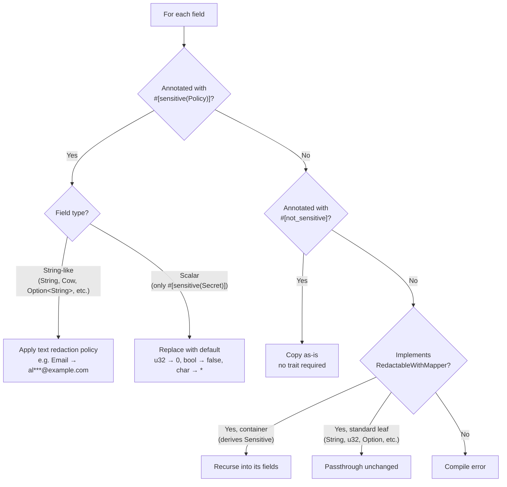
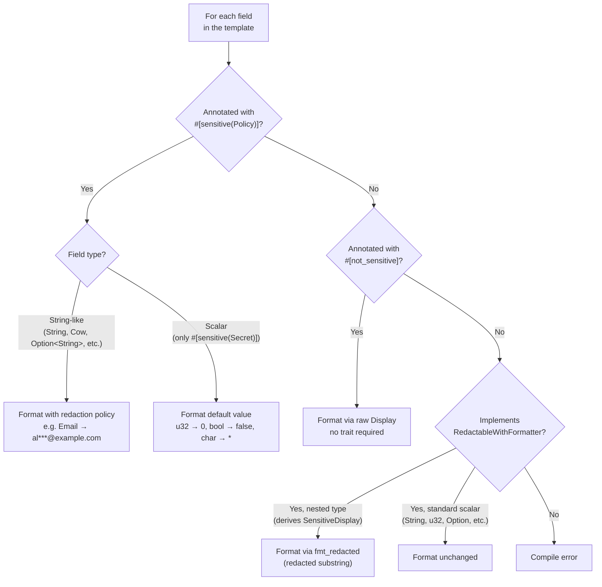
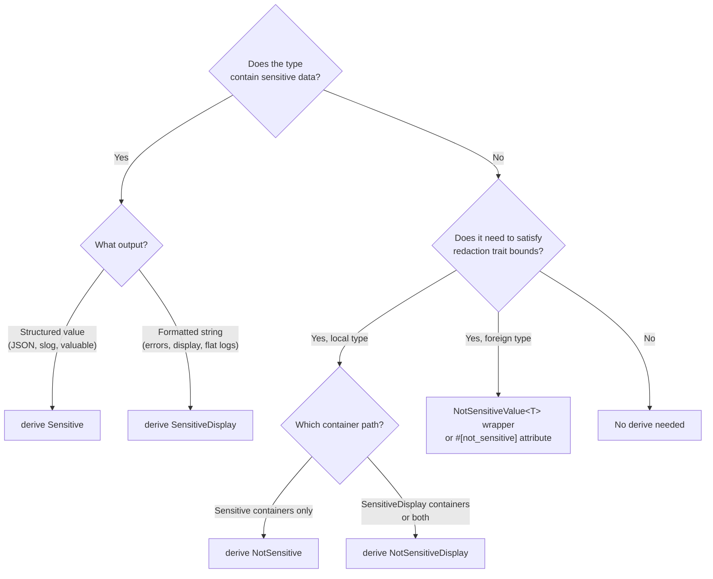
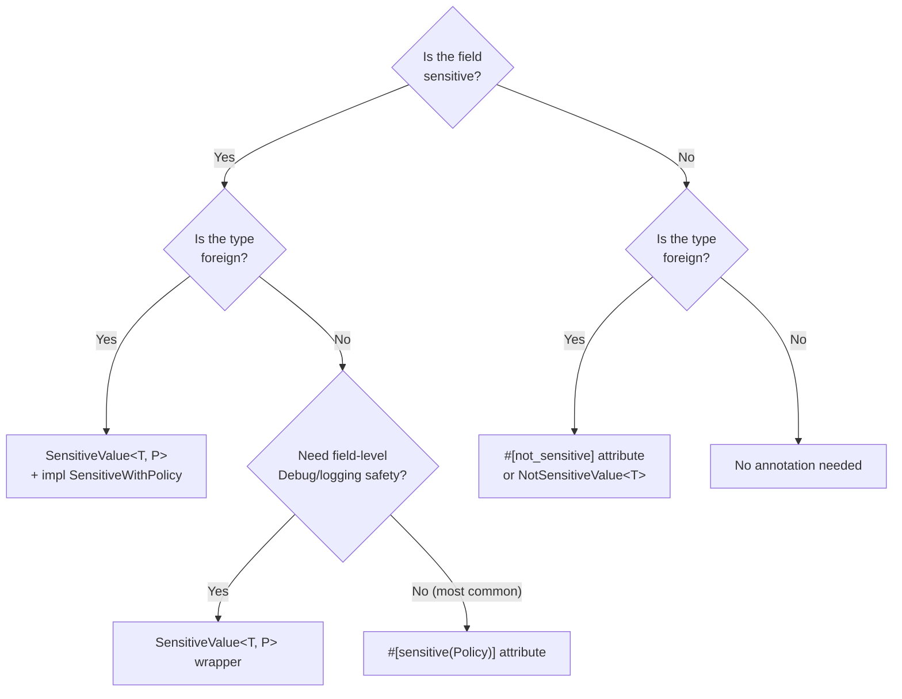

# Redactable

`redactable` is a redaction library for Rust. It lets you mark sensitive data in your structs and enums and produce a safe, redacted version for logging and telemetry. Redaction is not tied to any logging framework.

## Table of Contents

- [Getting started](#getting-started)
  - [Quick examples](#quick-examples)
  - [What each derive generates](#what-each-derive-generates)
- [Design principles](#design-principles)
- [How Sensitive works](#how-sensitive-works)
  - [Why do standard leaves implement RedactableWithMapper?](#why-do-standard-leaves-implement-redactablewithmapper)
  - [What if a field doesn't implement RedactableWithMapper?](#what-if-a-field-doesnt-implement-redactablewithmapper)
  - [The `#[sensitive(Policy)]` attribute](#the-sensitivepolicy-attribute)
  - [How the Sensitive macro processes each field](#how-the-sensitive-macro-processes-each-field)
- [How SensitiveDisplay works](#how-sensitivedisplay-works)
  - [Template syntax](#template-syntax)
  - [Why do scalars implement RedactableWithFormatter?](#why-do-scalars-implement-redactablewithformatter)
  - [What if a field doesn't implement RedactableWithFormatter?](#what-if-a-field-doesnt-implement-redactablewithformatter)
  - [The `#[sensitive(Policy)]` attribute in templates](#the-sensitivepolicy-attribute-in-templates)
  - [How the SensitiveDisplay macro processes each field](#how-the-sensitivedisplay-macro-processes-each-field)
- [NotSensitive and NotSensitiveDisplay](#notsensitive-and-notsensitivedisplay)
  - [`NotSensitive`](#notsensitive)
  - [`NotSensitiveDisplay`](#notsensitivedisplay)
  - [What all four derives generate](#what-all-four-derives-generate)
- [Wrapper types](#wrapper-types)
  - [Use cases](#use-cases)
- [Integrations](#integrations)
  - [slog](#slog)
  - [tracing](#tracing)
- [Logging safety](#logging-safety)
  - [Enforcing redaction at compile time](#enforcing-redaction-at-compile-time)
  - [`ToRedactedOutput` for custom pipelines](#toredactedoutput-for-custom-pipelines)
- [Choosing what to use](#choosing-what-to-use)
  - [Which derive macro?](#which-derive-macro)
  - [How to handle each field](#how-to-handle-each-field)
  - [How to log safely](#how-to-log-safely)
- [Reference](#reference)
  - [Supported types](#supported-types)
  - [Precedence and edge cases](#precedence-and-edge-cases)
  - [Built-in policies](#built-in-policies)
  - [Custom policies](#custom-policies)

## Getting started

There are two derive macros for types with sensitive data. Which one to use depends on whether you need the redacted result as a structured value or as a string.

Use `Sensitive` when you need the **redacted value as a structured type**. E.g. `.redact()` returns a `User` with redacted fields, not a string. The result can be serialized to JSON, passed to slog, inspected via `valuable` in tracing, or consumed by anything that works with typed data.

Use `SensitiveDisplay` when you need the **redacted value as a formatted string**. `.redacted_display()` returns a string with sensitive parts replaced. This is the natural fit for error messages, display output, flat log lines, and any context that expects text.

### Quick examples

**Structured** (`Sensitive`), logged as JSON:

```rust
use redactable::Sensitive;

#[derive(Clone, Sensitive, Serialize)]
struct User {
    name: String,
    #[sensitive(Email)]
    email: String,
}

let user = User { name: "alice".into(), email: "alice@example.com".into() };
let redacted = user.clone().redact();
assert_eq!(redacted.name, "alice");
assert_eq!(redacted.email, "al***@example.com");

// slog: automatic redaction, logged as structured JSON
slog::info!(logger, "user"; "user" => &user);
// → {"name":"alice","email":"al***@example.com"}
```

**String** (`SensitiveDisplay`), logged as text:

```rust
use redactable::SensitiveDisplay;

#[derive(SensitiveDisplay)]
enum AuthError {
    #[error("login failed for {user} with {password}")]
    InvalidCredentials {
        user: String,
        #[sensitive(Secret)]
        password: String,
    },
}

let err = AuthError::InvalidCredentials {
    user: "alice".into(),
    password: "hunter2".into(),
};
assert_eq!(err.redacted_display(), "login failed for alice [REDACTED]");
```

### What each derive generates

| Derive | Output | `Debug` | Logging |
|---|---|---|---|
| `Sensitive` | Same type with redacted leaves (via `RedactableWithMapper`) | ✅ (redacted) | ✅ |
| `SensitiveDisplay` | Redacted string (via `RedactableWithFormatter`) | ✅ (redacted) | ✅ |

- Both generate a conditional `Debug` impl: redacted output in production, actual values in test builds (`cfg(test)` or `feature = "testing"`). This means all field types must implement `Debug`. Opt out with `#[sensitive(skip_debug)]`.
- Both generate `slog::Value` + `SlogRedacted` (requires `slog` feature) and `TracingRedacted` (requires `tracing` feature). `Sensitive` emits structured JSON via slog (requires `Serialize`). `SensitiveDisplay` emits the redacted display string.
- `Sensitive` requires `Clone` since `.redact()` consumes `self`. `SensitiveDisplay` works by reference, so no `Clone` is needed.

## Design principles

The library follows three principles:

1. **Redaction should be opt-in.** No data is redacted unless you explicitly mark it with `#[sensitive(Policy)]`. Unannotated fields pass through unchanged. You choose what to protect and how.
2. **Traversal should be automatic.** Nested containers are walked recursively without manual intervention. For `Sensitive`, this happens via `RedactableWithMapper`. For `SensitiveDisplay`, via `RedactableWithFormatter`.
3. **Both paths should share the same annotation model.** Whether you use `Sensitive` or `SensitiveDisplay`, the workflow is identical: unannotated fields pass through, containers delegate to their trait, and `#[sensitive(Policy)]` applies redaction.

## How Sensitive works

`Sensitive` generates traversal code by implementing the `RedactableWithMapper` trait. Containers are just scaffolding: they get walked recursively until a leaf is reached. Leaves are where things actually happen:

- Unannotated leaves pass through unchanged.
- Annotated leaves (`#[sensitive(Policy)]`) are where redaction is applied.

| Field kind | What happens |
|---|---|
| **Containers** (structs/enums deriving `Sensitive`) | Traversal walks into them recursively, visiting each field |
| **Standard leaves** (`String`, primitives, `Option`, `Vec`, etc.) | Built-in `RedactableWithMapper` implementation that performs no redaction; returned unchanged |
| **Annotated leaves** (`#[sensitive(Policy)]`) | The macro generates transformation code that applies the policy, bypassing the normal passthrough |
| **Explicit passthrough** (`#[not_sensitive]`) | Skips the `RedactableWithMapper` requirement entirely; the field is copied as-is with no redaction. Use for types that don't have a built-in implementation |

```rust
#[derive(Clone, Sensitive)]
struct Address {
    city: String,
}

struct Account {  // Does NOT derive Sensitive
    password: String,
}

#[derive(Clone, Sensitive)]
struct User {
    address: Address,       // ✅ container → walks into it
    name: String,           // ✅ standard leaf → passthrough (unchanged)
    #[sensitive(Token)]
    api_key: String,        // ✅ annotated leaf → policy applied (redacted)
    account: Account,       // ❌ ERROR: Account does not implement RedactableWithMapper
}
```

### Why do standard leaves implement RedactableWithMapper?

Every field in a `Sensitive` type must implement `RedactableWithMapper`. But redaction [should be opt-in](#design-principles): if you don't annotate a field, nothing should happen to it. Standard leaves like `String` and `u32` square this circle by implementing `RedactableWithMapper` as a no-op. They satisfy the trait bound, but they don't transform anything. You only annotate what you actually want to protect.

The following types all have this built-in no-op implementation:

- **Scalars**: `bool`, `char`, `i8`..`i128`, `isize`, `u8`..`u128`, `usize`, `f32`, `f64`, `NonZeroI8`..`NonZeroUsize`
- **Strings**: `String`, `Cow<str>`
- **Containers** (delegate to inner values): `Option`, `Vec`, `Box`, `Arc`, `Rc`, `RefCell`, `Cell`, `Result`, `HashMap`, `BTreeMap`, `HashSet`, `BTreeSet`
- **Other**: `Duration`, `Instant`, `SystemTime`, `Ordering`, `PhantomData`, `IpAddr`, `Ipv4Addr`, `Ipv6Addr`, `SocketAddr`

```rust
#[derive(Clone, Sensitive)]
struct Inner {
    #[sensitive(Secret)]
    secret: String,
}

#[derive(Clone, Sensitive)]
struct Outer {
    name: String,                   // String passthrough → unchanged
    age: u32,                       // u32 passthrough → unchanged
    maybe_string: Option<String>,   // Option delegates, inner String is passthrough → unchanged
    maybe_inner: Option<Inner>,     // Option delegates, inner Inner is walked → secret redacted
    #[sensitive(Secret)]
    secret: Option<String>,         // #[sensitive] applies policy through the Option
}

let outer = Outer {
    name: "alice".into(),
    age: 30,
    maybe_string: Some("visible".into()),
    maybe_inner: Some(Inner { secret: "hidden".into() }),
    secret: Some("also_hidden".into()),
};
let redacted = outer.redact();

assert_eq!(redacted.name, "alice");                               // unchanged
assert_eq!(redacted.age, 30);                                     // unchanged
assert_eq!(redacted.maybe_string, Some("visible".into()));        // unchanged
assert_eq!(redacted.maybe_inner.unwrap().secret, "[REDACTED]");   // walked and redacted
assert_eq!(redacted.secret, Some("[REDACTED]".into()));           // policy applied
```

### What if a field doesn't implement RedactableWithMapper?

If a field type does not implement `RedactableWithMapper`, you get a compilation error. To fix this:

- **Local types:** derive `Sensitive` on the type so it participates in traversal:

  ```rust
  #[derive(Clone, Sensitive)]
  struct Account { /* ... */ }  // now implements RedactableWithMapper
  ```

- **Foreign types**: use `#[not_sensitive]` to skip the field:

  ```rust
  #[derive(Clone, Sensitive)]
  struct Config {
      #[not_sensitive]
      timeout: external_crate::Timeout,  // skips RedactableWithMapper entirely
  }
  ```

  `#[not_sensitive]` is the simplest escape hatch. Alternatively, the library provides dedicated wrapper types covered in [Wrapper types for foreign types](#wrapper-types-for-foreign-types).

### The `#[sensitive(Policy)]` attribute

The `#[sensitive(Policy)]` attribute marks a leaf as sensitive and applies a redaction policy. When present, the derive macro generates transformation code that applies the policy directly, bypassing the normal `RedactableWithMapper::redact_with` passthrough:

- `#[sensitive(Secret)]` on scalars: replaces the value with a default (0, false, `'*'`)
- `#[sensitive(Secret)]` on strings: replaces with `"[REDACTED]"`
- `#[sensitive(Policy)]` on strings: applies the policy's redaction rules

```rust
#[derive(Clone, Sensitive)]
struct Login {
    username: String,           // unchanged
    #[sensitive(Secret)]
    password: String,           // redacted to "[REDACTED]"
    #[sensitive(Email)]
    email: String,              // redacted to "al***@example.com"
    #[sensitive(Secret)]
    attempts: u32,              // redacted to 0
}
```

⚠️ **Qualified primitive paths don't work with `#[sensitive(Secret)]`.** The macro recognizes scalars by their bare names (`u32`, `bool`, `char`). Qualified paths like `std::primitive::u32` are not recognized and will produce a compile error. Always use the bare name.

### How the Sensitive macro processes each field



## How SensitiveDisplay works

`SensitiveDisplay` generates formatting code by implementing the `RedactableWithFormatter` trait. Unlike `Sensitive`, which walks every field and produces a redacted copy of the same type, `SensitiveDisplay` is **template-driven**: only fields referenced in the display template are formatted. Fields absent from the template are ignored entirely.

It works by reference (no `Clone` needed) and produces a string:

- Unannotated fields in the template are formatted unchanged.
- Annotated fields (`#[sensitive(Policy)]`) have redaction applied before formatting.
- Fields not in the template are not formatted at all.

| Field kind | What happens |
|---|---|
| **Nested types** (structs/enums deriving `SensitiveDisplay`) | Uses their `RedactableWithFormatter` to produce a redacted substring |
| **Standard scalars** (`String`, primitives, `Option`, `Vec`, etc.) | Built-in `RedactableWithFormatter` implementation; formatted unchanged |
| **Annotated fields** (`#[sensitive(Policy)]`) | The macro generates formatting code that applies the policy |
| **Explicit passthrough** (`#[not_sensitive]`) | Renders via raw `Display` (or `Debug` if `{:?}`). Skips the `RedactableWithFormatter` requirement. Use for types without a built-in implementation |

```rust
#[derive(SensitiveDisplay)]
enum InnerError {
    #[error("db password {password}")]
    Database {
        #[sensitive(Secret)]
        password: String,
    },
}

struct ExternalContext;  // Does NOT derive SensitiveDisplay
impl std::fmt::Display for ExternalContext {
    fn fmt(&self, f: &mut std::fmt::Formatter<'_>) -> std::fmt::Result {
        f.write_str("external")
    }
}

#[derive(SensitiveDisplay)]
enum AppError {
    #[error("user {name} (attempt {count})")]
    UserError {
        name: String,              // ✅ standard scalar → formatted unchanged
        count: u32,                // ✅ standard scalar → formatted unchanged
    },

    #[error("auth: {password}")]
    AuthFailed {
        #[sensitive(Secret)]
        password: String,          // ✅ annotated → "[REDACTED]"
    },

    #[error("caused by: {source}")]
    Nested {
        source: InnerError,        // ✅ nested type → redacted via RedactableWithFormatter
    },

    #[error("context: {ctx}")]
    WithContext {
        ctx: ExternalContext,      // ❌ ERROR: does not implement RedactableWithFormatter
    },
}

let err = AppError::UserError { name: "alice".into(), count: 3 };
assert_eq!(err.redacted_display(), "user alice (attempt 3)");       // scalars unchanged

let err = AppError::AuthFailed { password: "hunter2".into() };
assert_eq!(err.redacted_display(), "auth: [REDACTED]");             // policy applied

let err = AppError::Nested {
    source: InnerError::Database { password: "secret".into() },
};
assert_eq!(err.redacted_display(), "caused by: db password [REDACTED]");  // nested redaction
```

### Template syntax

The display template comes from one of two sources:

**`#[error("...")]` attribute** (thiserror-style):

```rust
#[derive(SensitiveDisplay)]
enum ApiError {
    #[error("auth failed for {user}")]
    AuthFailed { user: String },
}
```

**Doc comment** (same syntax as `displaydoc`, but parsed by the macro itself):

```rust
#[derive(SensitiveDisplay)]
enum ApiError {
    /// auth failed for {user}
    AuthFailed { user: String },
}
```

Both support named placeholders (`{field_name}`), positional placeholders (`{0}`, `{1}`), and debug formatting (`{field:?}`).

### Why do scalars implement RedactableWithFormatter?

The same [design principle](#design-principles) applies: redaction should be opt-in. Every field referenced in a template must implement `RedactableWithFormatter`, but if you don't annotate a field, nothing should happen to it. Standard scalars like `String` and `u32` implement `RedactableWithFormatter` as a no-op that formats the value unchanged. You only annotate what you actually want to protect.

The built-in types are the same as for `RedactableWithMapper` (see the [full list](#why-do-standard-leaves-implement-redactablewithmapper)). All scalars, strings, containers, and time types have passthrough implementations for both traits.

```rust
#[derive(SensitiveDisplay)]
enum Event {
    #[error("user {name} (age {age}, active: {active})")]
    UserInfo {
        name: String,       // formats as "alice"
        age: u32,           // formats as "30"
        active: bool,       // formats as "true"
    },
}

let event = Event::UserInfo { name: "alice".into(), age: 30, active: true };
assert_eq!(event.redacted_display(), "user alice (age 30, active: true)");
```

### What if a field doesn't implement RedactableWithFormatter?

If a template references a field whose type does not implement `RedactableWithFormatter`, you get a compilation error. To fix this:

- **Local types:** derive `SensitiveDisplay` on the type so it participates in redacted formatting:

  ```rust
  #[derive(SensitiveDisplay)]
  enum DatabaseError {
      #[error("connection failed: {detail}")]
      Connection { detail: String },
  }
  // Now DatabaseError implements RedactableWithFormatter
  ```

- **Foreign types:** use `#[not_sensitive]` to render via raw `Display` instead:

  ```rust
  #[derive(SensitiveDisplay)]
  enum AppError {
      #[error("context: {ctx}")]
      WithContext {
          #[not_sensitive]
          ctx: external_crate::ErrorContext,  // renders via Display, skips RedactableWithFormatter
      },
  }
  ```

  `#[not_sensitive]` is the simplest escape hatch. See [Wrapper types for foreign types](#wrapper-types-for-foreign-types) for more patterns.

### The `#[sensitive(Policy)]` attribute in templates

`#[sensitive(Policy)]` marks a field as sensitive and applies a redaction policy. The behavior is the same as in `Sensitive`, but the output is formatted into the template string:

- `#[sensitive(Secret)]` on strings: replaces with `"[REDACTED]"`
- `#[sensitive(Secret)]` on scalars: replaces with the default value (`0`, `false`, `'*'`)
- `#[sensitive(Policy)]` on strings: applies the policy's redaction rules

```rust
#[derive(SensitiveDisplay)]
enum AuthEvent {
    #[error("login by {email} with token {token} (attempt {attempt})")]
    Login {
        #[sensitive(Email)]
        email: String,              // → "al***@example.com"
        #[sensitive(Token)]
        token: String,              // → "***********2345"
        #[sensitive(Secret)]
        attempt: u32,               // → 0
    },
}

let event = AuthEvent::Login {
    email: "alice@example.com".into(),
    token: "sk-secret-12345".into(),
    attempt: 3,
};
assert_eq!(
    event.redacted_display(),
    "login by al***@example.com with token ***********2345 (attempt 0)"
);
```

### How the SensitiveDisplay macro processes each field



## NotSensitive and NotSensitiveDisplay

Types with no sensitive data still need to participate in the redaction system for two reasons:

1. **Composition**: every field in a `Sensitive` type must implement `RedactableWithMapper`, and every field in a `SensitiveDisplay` template must implement `RedactableWithFormatter`. Non-sensitive field types need to satisfy these bounds.

2. **Logging safety**: the `SlogRedacted` and `TracingRedacted` marker traits (see [Logging safety](#logging-safety)) let you enforce that only certified types pass through your logging pipeline. Non-sensitive types need these markers to be loggable alongside sensitive ones.

`NotSensitive` and `NotSensitiveDisplay` solve both problems. They generate the required traits as no-op passthroughs and provide full logging integration. The choice between them follows the same sink-driven logic: `NotSensitive` for the structured path, `NotSensitiveDisplay` for the string path.

### `NotSensitive`

`NotSensitive` is for types with no sensitive data that need to work inside `Sensitive` containers:

```rust
use redactable::{NotSensitive, Sensitive};

#[derive(Clone, Debug, NotSensitive)]
struct PublicMetadata {
    version: String,
    timestamp: u64,
}

#[derive(Clone, Sensitive)]
struct Config {
    #[sensitive(Secret)]
    api_key: String,
    metadata: PublicMetadata,  // ✅ NotSensitive provides RedactableWithMapper
}
```

`NotSensitive` generates:
- `RedactableWithMapper`: no-op passthrough (the type has no sensitive data)
- `slog::Value` and `SlogRedacted`: serializes the value directly as structured JSON, same format as `Sensitive` but without redaction (when `slog` feature is enabled; requires `Serialize` on the type)
- `TracingRedacted`: when `tracing` feature is enabled

### `NotSensitiveDisplay`

`NotSensitiveDisplay` is for types with no sensitive data that have a `Display` impl:

```rust
use redactable::NotSensitiveDisplay;

/// Retry using backoff
#[derive(Clone, NotSensitiveDisplay)]
enum RetryDecision {
    Retry { delay_ms: u64 },
    Abort,
}

impl std::fmt::Display for RetryDecision {
    fn fmt(&self, f: &mut std::fmt::Formatter<'_>) -> std::fmt::Result {
        match self {
            Self::Retry { delay_ms } => write!(f, "Retry after {}ms", delay_ms),
            Self::Abort => write!(f, "Abort"),
        }
    }
}
```

`NotSensitiveDisplay` generates:
- `RedactableWithMapper`: no-op passthrough (allows use inside `Sensitive` containers)
- `RedactableWithFormatter`: delegates to `Display::fmt` (allows use inside `SensitiveDisplay` containers)
- `slog::Value` and `SlogRedacted`: when `slog` feature is enabled
- `TracingRedacted`: when `tracing` feature is enabled

This cross-path compatibility makes `NotSensitiveDisplay` uniquely versatile. It is the only derive that works as a field in both `Sensitive` and `SensitiveDisplay` containers.

`NotSensitiveDisplay` works naturally with `displaydoc` or similar crates that derive `Display`:

```rust
use redactable::NotSensitiveDisplay;

#[derive(Clone, displaydoc::Display, NotSensitiveDisplay)]
enum RetryDecision {
    /// Retry using backoff
    Retry,
    /// Do not retry
    Abort,
}
// Now RetryDecision has Display (from displaydoc), RedactableWithFormatter, slog::Value, etc.
```

### What all four derives generate

| Derive | `RedactableWithMapper` | `RedactableWithFormatter` | `Debug` |
|---|---|---|---|
| `Sensitive` | ✅ | - | ✅ (redacted) |
| `SensitiveDisplay` | - | ✅ | ✅ (redacted) |
| `NotSensitive` | ✅ | - | - |
| `NotSensitiveDisplay` | ✅ | ✅ | - |

About `Debug`:

- `Sensitive` and `SensitiveDisplay` generate a conditional impl: redacted in production, actual values in `cfg(test)` or `feature = "testing"`. Opt out with `#[sensitive(skip_debug)]`.
- `NotSensitive` and `NotSensitiveDisplay` do not override `Debug`. There is nothing to redact. Add `#[derive(Debug)]` separately when you need it.

## Wrapper types

The library provides two wrapper types that give values a direct relationship with the redaction system:

- **`SensitiveValue<T, P>`**
  - Wraps a value of type `T` and associates it with a redaction policy `P`
  - Implements `Debug` with redacted output
  - Does **not** implement `Display` (prevents accidental raw formatting)
  - Implements `slog::Value` + `SlogRedacted` (requires `slog` feature) and `TracingRedacted` (requires `tracing` feature)
  - Provides `.redacted()` for the redacted form and `.expose()` for raw access
- **`NotSensitiveValue<T>`**
  - Wraps a non-sensitive type to satisfy `RedactableWithMapper` bounds
  - Passes the value through unchanged

### Use cases

Wrapper types exist for two purposes:

#### Foreign types

You can't derive macros on types defined in other crates, and the orphan rule prevents you from implementing the internal traits they need (`RedactableWithMapper`, `PolicyApplicable`) because neither the trait nor the type is local. Wrappers provide those implementations for you. You only need to implement `SensitiveWithPolicy<P>`, which the orphan rule allows because your policy type is local.

For sensitive foreign types, implement `SensitiveWithPolicy<P>` with a [custom policy](#custom-policies) (the orphan rule requires the policy type to be local) and wrap with `SensitiveValue`:

```rust
use redactable::{SensitiveValue, SensitiveWithPolicy, Sensitive, Token, TextRedactionPolicy};

// Imagine this comes from a payments SDK.
// It exposes accessors but no redaction support.
#[derive(Clone)]
struct MerchantAccount {
    id: String,
    name: String,
    tax_id: String,
}

impl MerchantAccount {
    fn tax_id(&self) -> &str { &self.tax_id }
}

impl SensitiveWithPolicy<Pii> for MerchantAccount {
    fn redact_with_policy(self, policy: &TextRedactionPolicy) -> Self {
        Self {
            id: self.id,
            name: policy.apply_to(&self.name),
            tax_id: policy.apply_to(&self.tax_id),
        }
    }
    fn redacted_string(&self, policy: &TextRedactionPolicy) -> String {
        format!("MerchantAccount({}, {})", policy.apply_to(&self.name), policy.apply_to(&self.tax_id))
    }
}

#[derive(Clone, Sensitive)]
struct PaymentConfig {
    merchant: SensitiveValue<MerchantAccount, Pii>,
}
```

For non-sensitive foreign types, wrap with `NotSensitiveValue`:

```rust
use redactable::{NotSensitiveValue, Sensitive};

struct ForeignConfig { timeout: u64 }  // (pretend this is from another crate)

#[derive(Clone, Sensitive)]
struct AppConfig {
    foreign: NotSensitiveValue<ForeignConfig>,  // passes through unchanged
}
```

#### Field-level redaction awareness

With `#[sensitive(P)]` attributes, fields are still bare types at runtime. A `String` is a `String`, and nothing stops you from accessing or formatting it unredacted. `SensitiveValue<T, P>` changes the runtime type itself: the field carries its policy, its `Debug` shows the redacted form, and `Display` is deliberately not implemented so accidental formatting won't compile. Each field can be redacted, logged, or inspected independently, without going through the parent container:

```rust
#[derive(Clone, Sensitive)]
struct User {
    email: SensitiveValue<String, Pii>,  // The value IS a wrapper, not a bare String
}

let user = User { email: SensitiveValue::from("alice@example.com".into()) };

// ✅ Safe: Debug shows the policy-redacted value, not the raw email
log::info!("Email: {:?}", user.email);

// ✅ Safe: explicit call for redacted form
log::info!("Email: {}", user.email.redacted());

// ⚠️ Intentional: .expose() for raw access (code review catches this)
let raw = user.email.expose();
```

Compare with `#[sensitive(P)]` attributes, where the field is a bare type at runtime:

| | `#[sensitive(P)]` | `SensitiveValue<T, P>` |
|---|---|---|
| **Ergonomics** | ✅ Work with actual types | ❌ Need `.expose()` everywhere |
| **Display (`{}`)** | Shows raw value | ✅ Not implemented (won't compile) |
| **Debug (`{:?}`)** | ✅ Shows `[REDACTED]`* | ✅ Shows policy-redacted value |
| **Serialization** | Shows raw value | Shows raw value |
| **slog/tracing safety** | ✅ Via container | ✅ Direct |

\* The `Sensitive` and `SensitiveDisplay` derives generate `Debug` impls that show `[REDACTED]`
  for sensitive data (disabled in test mode via `cfg(test)` or `feature = "testing"`).

⚠️ **Things to keep in mind:**

- **`NotSensitiveValue` has no role here**
  - It carries no policy and provides no redaction awareness.
  - For local non-sensitive types, just use `#[derive(NotSensitive)]`.
- **Serialization is not protected**
  - Both `#[sensitive(P)]` and `SensitiveValue` serialize to raw values.
  - This is intentional (APIs, databases, queues need the real data).
  - If you need redacted serialization, call `.redact()` before serializing.
- **Wrappers are leaf-only**
  - Neither wrapper walks nested fields or applies inner `#[sensitive(...)]` annotations.
  - In practice this is not a limitation: types that derive `Sensitive` already implement `RedactableWithMapper` and don't need wrapping.

## Integrations

### slog

The `slog` feature enables automatic redaction. Just log your values and they're redacted:

```toml
[dependencies]
redactable = { version = "0.5", features = ["slog"] }
```

**Containers**: the `Sensitive` derive generates `slog::Value` automatically:

```rust
#[derive(Clone, Sensitive, Serialize)]
struct PaymentEvent {
    #[sensitive(Email)]
    customer_email: String,
    #[sensitive(CreditCard)]
    card_number: String,
    amount: u64,
}

let event = PaymentEvent {
    customer_email: "alice@example.com".into(),
    card_number: "4111111111111234".into(),
    amount: 9999,
};

// Just log it - slog::Value impl handles redaction automatically
slog::info!(logger, "payment"; "event" => &event);
// Logged JSON: {"customer_email":"al***@example.com","card_number":"************1234","amount":9999}
```

**Leaf wrappers**: `SensitiveValue<T, P>` also implements `slog::Value`:

```rust
let api_token: SensitiveValue<String, Token> = SensitiveValue::from("sk-secret-key".into());

// Also automatic - SensitiveValue has its own slog::Value impl
slog::info!(logger, "auth"; "token" => &api_token);
// Logged: "*********-key"
```

Both work because they implement `slog::Value`. Containers get it via the derive macro, wrappers via a manual implementation. No explicit conversion needed. `Sensitive` emits structured JSON; `SensitiveDisplay` emits the redacted display string.

### tracing

For structured logging with tracing, use the `valuable` integration:

```toml
[dependencies]
redactable = { version = "0.5", features = ["tracing-valuable"] }
```

```rust
use redactable::tracing::TracingValuableExt;

#[derive(Clone, Sensitive, valuable::Valuable)]
struct AuthEvent {
    #[sensitive(Token)]
    api_key: String,
    #[sensitive(Email)]
    user_email: String,
    action: String,
}

let event = AuthEvent {
    api_key: "sk-secret-key-12345".into(),
    user_email: "alice@example.com".into(),
    action: "login".into(),
};

// Redacts and logs as structured data - subscriber can traverse containers
tracing::info!(event = event.tracing_redacted_valuable());
// Logged: {api_key: "***************2345", user_email: "al***@example.com", action: "login"}
```

Unlike slog where `slog::Value` can be implemented automatically via the derive macro, tracing's `Value` trait is sealed. The `valuable` crate provides the structured data path. `.tracing_redacted_valuable()` redacts first, then wraps for `valuable` inspection.

**For individual values** (without `valuable`):

```rust
use redactable::tracing::TracingRedactedExt;

let api_key: SensitiveValue<String, Token> = SensitiveValue::from("sk-secret-key-12345".into());
let user_email: SensitiveValue<String, Email> = SensitiveValue::from("alice@example.com".into());

tracing::info!(
    api_key = api_key.tracing_redacted(),
    user_email = user_email.tracing_redacted(),
    action = "login"
);
// Logged: api_key="***************2345" user_email="al***@example.com" action="login"
```

⚠️ **Note:** The `valuable` integration in tracing is still marked as unstable and requires a compatible subscriber.

## Logging safety

For most use cases, the [slog](#slog) and [tracing](#tracing) integrations handle safety automatically. This section covers how to enforce redaction at compile time and how to build custom logging pipelines.

### Enforcing redaction at compile time

`SlogRedacted` and `TracingRedacted` are marker traits that certify a type is safe to log through a specific sink. They guarantee the sink adapter routes through the redacted path rather than exposing raw values. All four derive macros implement them automatically when the corresponding feature is enabled, as does `SensitiveValue<T, P>`.

Use these traits as bounds in your own logging macros to make unredacted logging a compile error:

```rust
use redactable::slog::SlogRedacted;

macro_rules! slog_safe {
    ($logger:expr, $msg:literal; $($key:literal => $value:expr),* $(,)?) => {{
        fn assert_slog_safe<T: SlogRedacted + slog::Value>(_: &T) {}
        $(assert_slog_safe(&$value);)*
        slog::info!($logger, $msg; $($key => &$value),*);
    }};
}

// ✅ Works: Sensitive-derived types implement SlogRedacted
slog_safe!(logger, "user logged in"; "user" => &user);

// ✅ Works: SensitiveValue implements SlogRedacted
slog_safe!(logger, "auth"; "token" => &api_token);  // SensitiveValue<String, Token>

// ❌ Won't compile: raw String doesn't implement SlogRedacted
slog_safe!(logger, "user"; "email" => &user.email);
```

The same pattern works for tracing:

```rust
use redactable::tracing::TracingRedacted;

macro_rules! trace_safe {
    ($($key:ident = $value:expr),* $(,)?) => {{
        fn assert_tracing_safe<T: TracingRedacted>(_: &T) {}
        $(assert_tracing_safe(&$value);)*
        tracing::info!($($key = tracing::field::debug(&$value)),*);
    }};
}
```

### `ToRedactedOutput` for custom pipelines

If you're not using slog or tracing, `ToRedactedOutput` is the single logging-safe bound. It produces a `RedactedOutput`: either `Text(String)` or `Json(serde_json::Value)` (requires `json` feature).

| Situation | Method | Returns |
|---|---|---|
| Structured container → redacted text | `.redacted_output()` | `RedactedOutput::Text` |
| Structured container → redacted JSON | `.redacted_json()` (requires `json` feature) | `RedactedOutput::Json` |
| Display type → redacted text | `.redacted_display()` or `.to_redacted_output()` | `RedactedOutput::Text` |
| Non-sensitive (delegate to framework) | `.not_sensitive()` | `NotSensitive<&Self>` |
| Non-sensitive (explicit Display) | `.not_sensitive_display()` | `NotSensitiveDisplay<&T>` |
| Non-sensitive (explicit Debug) | `.not_sensitive_debug()` | `NotSensitiveDebug<&T>` |
| Non-sensitive (explicit JSON) | `.not_sensitive_json()` (requires `json` feature) | `NotSensitiveJson<&T>` |

## Choosing what to use

This section brings together the decisions covered throughout the README into a single reference.

### Which derive macro?



### How to handle each field



### How to log safely

| Situation | Use |
|---|---|
| slog | Log containers directly: `slog::info!(logger, "msg"; "key" => &value)` |
| tracing (structured) | `.tracing_redacted_valuable()` on containers |
| tracing (individual values) | `.tracing_redacted()` on `SensitiveValue` wrappers |
| Custom logging pipeline | `ToRedactedOutput` trait bound ([details](#toredactedoutput-for-custom-pipelines)) |
| Compile-time enforcement | `SlogRedacted`/`TracingRedacted` bounds in macros ([details](#enforcing-redaction-at-compile-time)) |

## Reference

### Supported types

`#[sensitive(Policy)]` works on string-like types: `String`, `Cow<'_, str>`, and wrappers around them like `Option<String>`. `&str` is **not** supported for `Sensitive`; use owned strings or `Cow`.

`#[sensitive(Secret)]` also works on scalars: integers are replaced with `0`, floats with `0.0`, `bool` with `false`, `char` with `'*'`.

Containers (`Option`, `Vec`, `HashMap`, etc.) are walked automatically. Policy annotations apply through them. Map keys are formatted with `Debug` and are not redacted.

`serde_json::Value` (requires `json` feature) is treated as an opaque leaf that fully redacts to `Value::String("[REDACTED]")`, since its dynamic structure could contain anything sensitive.

For the full list of types with built-in passthrough implementations, see [Why do standard leaves implement RedactableWithMapper?](#why-do-standard-leaves-implement-redactablewithmapper).

### Precedence and edge cases

**`#[sensitive(Policy)]` on strings** works with `String` and `Cow<str>` (and their wrappers like `Option<String>`). Scalars can only use `#[sensitive(Secret)]`. For custom types, use the `SensitiveValue<T, Policy>` wrapper instead.

**Unannotated containers whose type derives `Sensitive` are still walked**. If a nested type has `#[sensitive(Policy)]` annotations on its leaves, those are applied even when the outer container is unannotated.

**Sets can collapse after redaction**. `HashSet`/`BTreeSet` are redacted element-by-element and then collected back into a set. If redaction makes elements equal (e.g., multiple values redact to `"[REDACTED]"`), the resulting set may shrink. If cardinality matters, prefer a `Vec`.

### Built-in policies

| Policy | Use for | Example output |
|---|---|---|
| `Secret` | Scalars or generic redaction | `0` / `false` / `'*'` / `[REDACTED]` |
| `Token` | API keys | `...f456` (last 4) |
| `Email` | Email addresses | `al***@example.com` |
| `CreditCard` | Card numbers | `...1234` (last 4) |
| `Pii` | Generic PII (names, addresses) | `...oe` (last 2) |
| `PhoneNumber` | Phone numbers | `...4567` (last 4) |
| `IpAddress` | IP addresses | `....100` (last 4) |
| `BlockchainAddress` | Wallet addresses | `...abcdef` (last 6) |

### Custom policies

```rust
use redactable::{RedactionPolicy, TextRedactionPolicy};

#[derive(Clone, Copy)]
struct InternalId;

impl RedactionPolicy for InternalId {
    fn policy() -> TextRedactionPolicy {
        TextRedactionPolicy::keep_last(2)
    }
}
```
