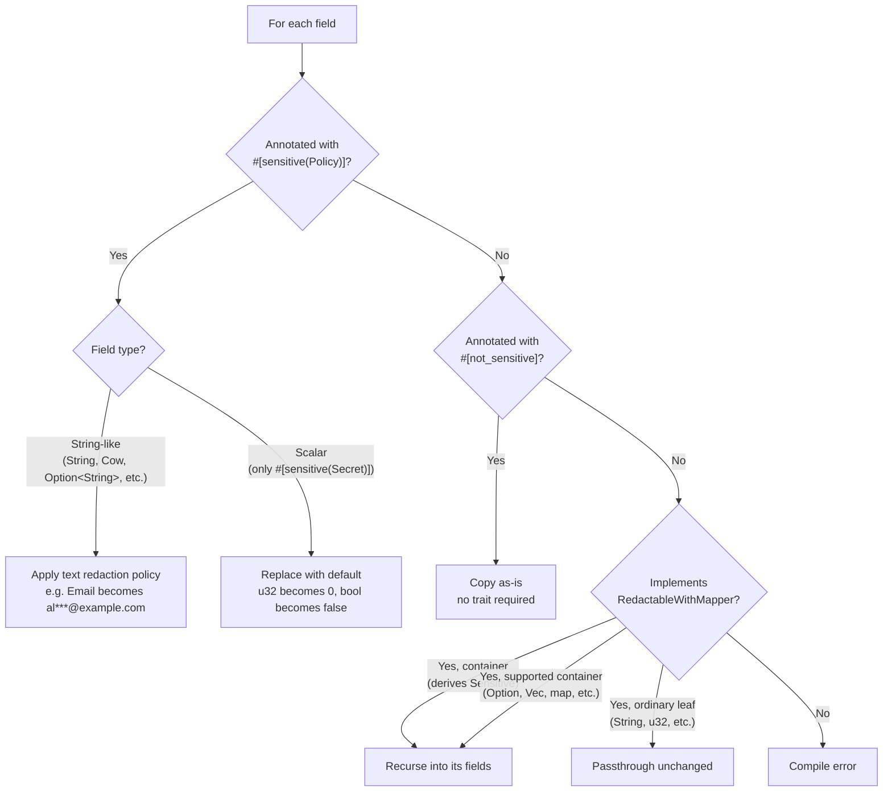
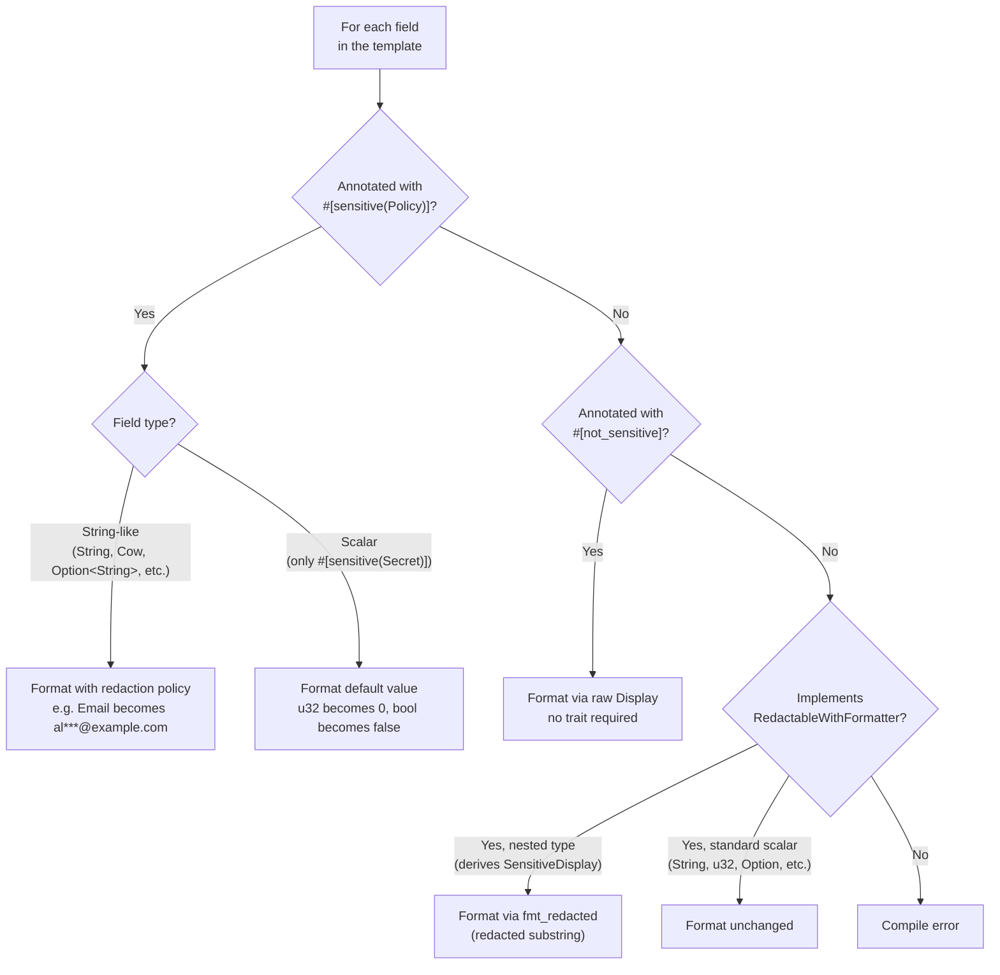

# Redactable

`redactable` marks sensitive fields in Rust structs and enums and produces
redacted output for logging and telemetry. It is not tied to a logging
framework.

Rust examples shown as runnable are compiled by the repository doctest gate. Blocks
marked `ignore` are deliberately incomplete sketches or require an external runtime
such as a configured logger; blocks marked `compile_fail` document rejected usage.

## Table of Contents

- [Getting started](#getting-started)
  - [Quick examples](#quick-examples)
  - [What each derive generates](#what-each-derive-generates)
- [Design principles](#design-principles)
- [How Sensitive works](#how-sensitive-works)
  - [Why do standard leaves implement RedactableWithMapper?](#why-do-standard-leaves-implement-redactablewithmapper)
  - [What if a field doesn't implement RedactableWithMapper?](#what-if-a-field-doesnt-implement-redactablewithmapper)
  - [The `#[sensitive(Policy)]` attribute](#the-sensitivepolicy-attribute)
  - [How the Sensitive macro processes each field](#how-the-sensitive-macro-processes-each-field)
  - [Types that implement `Drop`](#types-that-implement-drop)
- [How SensitiveDisplay works](#how-sensitivedisplay-works)
  - [Template syntax](#template-syntax)
  - [Why do scalars implement RedactableWithFormatter?](#why-do-scalars-implement-redactablewithformatter)
  - [What if a field doesn't implement RedactableWithFormatter?](#what-if-a-field-doesnt-implement-redactablewithformatter)
  - [The `#[sensitive(Policy)]` attribute in templates](#the-sensitivepolicy-attribute-in-templates)
  - [How the SensitiveDisplay macro processes each field](#how-the-sensitivedisplay-macro-processes-each-field)
- [NotSensitive and NotSensitiveDisplay](#notsensitive-and-notsensitivedisplay)
  - [`NotSensitive`](#notsensitive)
  - [`NotSensitiveDisplay`](#notsensitivedisplay)
- [Wrapper types](#wrapper-types)
  - [Choosing a wrapper](#choosing-a-wrapper)
  - [Use cases](#use-cases)
- [Integrations](#integrations)
  - [slog](#slog)
  - [tracing](#tracing)
- [Logging safety](#logging-safety)
  - [Enforcing redaction at compile time](#enforcing-redaction-at-compile-time)
  - [`ToRedactedOutput` for custom pipelines](#toredactedoutput-for-custom-pipelines)
- [Reference](#reference)
  - [Supported types](#supported-types)
  - [Advanced derive options](#advanced-derive-options)
  - [Precedence and edge cases](#precedence-and-edge-cases)
  - [Built-in policies](#built-in-policies)
  - [Custom policies](#custom-policies)

## Getting started

There are three derive macros for types with sensitive data. Use `Sensitive` for
structured redaction, `SensitiveDisplay` for formatted redaction, or
`SensitiveDual` when the same type needs both paths.

Use `Sensitive` when you need a **structured redacted value**. `.redact()`
returns the same type with its sensitive fields transformed. The result can be
serialized, passed to slog, or inspected through `valuable`.

Use `SensitiveDisplay` when you need **formatted redacted text**.
`.redacted_display()` returns a displayable view for errors, flat log lines,
and other text output.

### Quick examples

The runnable structured example uses Serde directly, so declare it alongside
`redactable`. Version 0.11 requires Rust 1.97 or later.

```toml
[dependencies]
redactable = "0.11"
serde = { version = "1", features = ["derive"] }
```

**Structured** (`Sensitive`), with a redacted copy:

```rust
use redactable::{Email, Redactable, Sensitive};

#[derive(Clone, Sensitive, serde::Serialize)]
struct User {
    name: String,
    #[sensitive(Email)]
    email: String,
}

let user = User { name: "alice".into(), email: "alice@example.com".into() };
let redacted = user.clone().redact();
assert_eq!(redacted.name, "alice");
assert_eq!(redacted.email, "al***@example.com");

```

**String** (`SensitiveDisplay`), logged as text:

```rust
use redactable::{RedactableWithFormatter, Secret, SensitiveDisplay};

#[derive(SensitiveDisplay)]
enum AuthError {
    #[error("login failed for {user} with {password}")]
    InvalidCredentials {
        user: String,
        #[sensitive(Secret)]
        password: String,
    },
}

let err = AuthError::InvalidCredentials {
    user: "alice".into(),
    password: "hunter2".into(),
};
assert_eq!(
    err.redacted_display().to_string(),
    "login failed for alice with [REDACTED]"
);
```

### What each derive generates

| Derive | Use | Structured | Formatted | `Debug` |
|---|---|---|---|---|
| `Sensitive` | Structured values | `Redactable` | - | Redacted |
| `SensitiveDisplay` | Text output | - | `ToRedactedOutput` | Redacted |
| `SensitiveDual` | Both paths | `Redactable` | `ToRedactedOutput` | Redacted |
| `NotSensitive` | Certified non-sensitive structured values | `Redactable` | - | Not generated |
| `NotSensitiveDisplay` | Certified non-sensitive values on both paths | `Redactable` | `ToRedactedOutput` | Not generated |

> **Security warning:** all three sensitive derives generate a conditional `Debug` impl
> that reveals actual field values in your crate's `cfg(test)` builds or when
> the `redactable/testing` feature is enabled. Never enable that feature in a
> production logging build. All field types must implement `Debug`.

The sensitive derives also generate the logging integrations enabled by the
`slog` and `tracing` features. See [Integrations](#integrations) for their sink
behavior and [Logging safety](#logging-safety) for owned and borrowed adapters.

`SensitiveDual` replaces the 0.10 combination of `Sensitive`,
`SensitiveDisplay`, and `#[sensitive(dual)]`. It generates both paths in one
derive. The legacy form now produces a migration diagnostic.

## Design principles

The library follows three principles:

1. **Redaction is opt-in.** Unannotated fields pass through unchanged.
2. **Traversal is automatic.** Supported containers delegate recursively to
   their contents.
3. **Both output paths use the same annotations.** `#[sensitive(Policy)]`
   applies a policy; `#[not_sensitive]` declares an explicit passthrough.

### Threat model

Redactable protects output only when it passes through a redacted API or a
generated logging integration. Raw field access, direct Serde serialization,
and explicit accessors can still expose the original value. Policies may also
retain approved fragments such as an email domain or token suffix.

The `testing` feature exposes raw generated `Debug`, and derived containers
that implement `Drop` are unsupported. Borrowed adapters clone the value and
inherit `Clone` panics. See [Logging safety](#logging-safety) for the owned and
borrowed adapter contracts.

`serde_json::Value` is the main traversal exception. With the `json` feature,
an unannotated value redacts to `"[REDACTED]"` during `.redact()` and adapters
that invoke it. Generated `Debug` remains annotation-driven.

## How Sensitive works

`Sensitive` implements `RedactableWithMapper`. Containers delegate recursively
until traversal reaches a leaf:

- Unannotated leaves pass through unchanged.
- Annotated leaves (`#[sensitive(Policy)]`) are where redaction is applied.

| Field kind | What happens |
|---|---|
| **Containers** (structs/enums deriving `Sensitive`) | Traversal walks into them recursively, visiting each field |
| **Ordinary leaves** (`String`, primitives, etc.) | Built-in `RedactableWithMapper` implementation that performs no redaction; returned unchanged |
| **Supported containers** (`Option`, `Vec`, maps, sets, pointers/cells, etc.) | Delegate recursively to their contained values |
| **Annotated leaves** (`#[sensitive(Policy)]`) | The macro generates transformation code that applies the policy, bypassing the normal passthrough |
| **Explicit passthrough** (`#[not_sensitive]`) | Skips the `RedactableWithMapper` requirement entirely; the field is copied as-is with no redaction. Use for types that don't have a built-in implementation |

```rust,compile_fail
use redactable::{Sensitive, Token};

#[derive(Clone, Sensitive)]
struct Address {
    city: String,
}

struct Account {  // Does NOT derive Sensitive
    password: String,
}

#[derive(Clone, Sensitive)]
struct User {
    address: Address,       // ✅ container, walks into it
    name: String,           // ✅ standard leaf, passthrough (unchanged)
    #[sensitive(Token)]
    api_key: String,        // ✅ annotated leaf, policy applied (redacted)
    account: Account,       // ❌ ERROR: Account does not implement RedactableWithMapper
}
```

### Why do standard leaves implement RedactableWithMapper?

Every field in a `Sensitive` type must implement `RedactableWithMapper`.
Standard leaves such as `String` and `u32` implement it as a no-op, so
unannotated data passes through unchanged.

This is traversal machinery, not output certification. Bare leaves do not
implement `Redactable`, so calling `.redact()` on a `String` is a compile error.
Certification comes from derives and explicit wrappers.

A summary of built-in leaves and containers is in
[Supported types](#supported-types).

```rust
use redactable::{Redactable, Secret, Sensitive};

#[derive(Clone, Sensitive, serde::Serialize)]
struct Inner {
    #[sensitive(Secret)]
    secret: String,
}

#[derive(Clone, Sensitive, serde::Serialize)]
struct Outer {
    name: String,                   // String passthrough, unchanged
    age: u32,                       // u32 passthrough, unchanged
    maybe_string: Option<String>,   // Option delegates; inner String is unchanged
    maybe_inner: Option<Inner>,     // Option delegates; Inner is walked and redacted
    #[sensitive(Secret)]
    secret: Option<String>,         // #[sensitive] applies policy through the Option
}

let outer = Outer {
    name: "alice".into(),
    age: 30,
    maybe_string: Some("visible".into()),
    maybe_inner: Some(Inner { secret: "hidden".into() }),
    secret: Some("also_hidden".into()),
};
let redacted = outer.redact();

assert_eq!(redacted.name, "alice");                               // unchanged
assert_eq!(redacted.age, 30);                                     // unchanged
assert_eq!(redacted.maybe_string, Some("visible".into()));        // unchanged
assert_eq!(redacted.maybe_inner.unwrap().secret, "[REDACTED]");   // walked and redacted
assert_eq!(redacted.secret, Some("[REDACTED]".into()));           // policy applied
```

### What if a field doesn't implement RedactableWithMapper?

If a field type does not implement `RedactableWithMapper`, you get a compilation error. To fix this:

- **Local types:** derive `Sensitive` on the type so it participates in traversal:

  ```rust
  use redactable::Sensitive;

  #[derive(Clone, Sensitive, serde::Serialize)]
  struct Account { /* ... */ }  // now implements RedactableWithMapper
  ```

- **Foreign types**: use `#[not_sensitive]` to skip the field. This sketch uses
  a placeholder external crate and is intentionally incomplete:

  ```rust,ignore
  #[derive(Clone, Sensitive)]
  struct Config {
      #[not_sensitive]
      timeout: external_crate::Timeout,  // skips RedactableWithMapper entirely
  }
  ```

  `#[not_sensitive]` is the simplest escape hatch. Alternatively, the library provides dedicated wrapper types covered in [Wrapper types for foreign types](#foreign-types).

### The `#[sensitive(Policy)]` attribute

`#[sensitive(Policy)]` marks a leaf as sensitive. The derive applies the policy
instead of the normal `RedactableWithMapper` passthrough:

- `#[sensitive(Secret)]` on scalars: replaces the value with a default (0, false, `'*'`)
- `#[sensitive(Secret)]` on strings: replaces with `"[REDACTED]"`
- `#[sensitive(Policy)]` on strings: applies the policy's redaction rules

```rust
use redactable::{Email, Secret, Sensitive};

#[derive(Clone, Sensitive, serde::Serialize)]
struct Login {
    username: String,           // unchanged
    #[sensitive(Secret)]
    password: String,           // redacted to "[REDACTED]"
    #[sensitive(Email)]
    email: String,              // redacted to "al***@example.com"
    #[sensitive(Secret)]
    attempts: u32,              // redacted to 0
}
```

`#[sensitive(Secret)]` accepts both bare primitive names such as `u32` and qualified standard-library paths such as `std::primitive::u32`.

### How the Sensitive macro processes each field


```mermaid
flowchart TD
    F["For each field"] --> A{"Annotated with<br/>#[sensitive(Policy)]?"}
    A -- Yes --> T{"Field type?"}
    T -- "String-like<br/>(String, Cow, Option&lt;String&gt;, etc.)" --> B["Apply text redaction policy<br/>e.g. Email becomes al***@example.com"]
    T -- "Scalar<br/>(only #[sensitive(Secret)])" --> C["Replace with default<br/>u32 becomes 0, bool becomes false"]
    A -- No --> D{"Annotated with<br/>#[not_sensitive]?"}
    D -- Yes --> E["Copy as-is<br/>no trait required"]
    D -- No --> G{"Implements<br/>RedactableWithMapper?"}
    G -- "Yes, container<br/>(derives Sensitive)" --> I["Recurse into its fields"]
    G -- "Yes, ordinary leaf<br/>(String, u32, etc.)" --> J["Passthrough unchanged"]
    G -- "Yes, supported container<br/>(Option, Vec, map, etc.)" --> I
    G -- No --> K["Compile error"]
```

### Types that implement `Drop`

`Sensitive` consumes `self` and moves its fields into a redacted value of the
same type. Container types that implement `Drop` are unsupported, including
Copy-only shapes that happen to compile: `.redact()` drops the consumed original
and later drops the replacement, which is not a supported container lifecycle.
This limitation also applies to `SensitiveDual`. A non-`Copy` field usually
makes the unsupported shape fail earlier with E0509.

The restriction is on the derived container itself. A type that does not
implement `Drop` can still derive `Sensitive` when its fields have their own
drop behavior, provided those fields satisfy the usual traversal bounds.

## How SensitiveDisplay works

`SensitiveDisplay` implements `RedactableWithFormatter`. It is template-driven:
only fields referenced in the display template are formatted. `Sensitive`
instead walks every field and produces a redacted value of the same type.

It formats by reference and produces a string. The generated text/secret route
does not require `Clone`; individual policy projections can add documented
bounds (IP-policy maps currently clone allowed keys and hashers):

- Unannotated fields in the template are formatted unchanged.
- Annotated fields (`#[sensitive(Policy)]`) have redaction applied before formatting.
- Fields not in the template are not formatted at all.

| Field kind | What happens |
|---|---|
| **Nested types** (structs/enums deriving `SensitiveDisplay`) | Uses their `RedactableWithFormatter` to produce a redacted substring |
| **Standard scalars** (`String`, primitives, `Option`, `Vec`, etc.) | Built-in `RedactableWithFormatter` implementation; formatted unchanged |
| **Annotated fields** (`#[sensitive(Policy)]`) | The macro generates formatting code that applies the policy |
| **Explicit passthrough** (`#[not_sensitive]`) | Renders via raw `Display` (or `Debug` if `{:?}`). Skips the `RedactableWithFormatter` requirement. Use for types without a built-in implementation |

```rust,compile_fail
use redactable::{RedactableWithFormatter, Secret, SensitiveDisplay};

#[derive(SensitiveDisplay)]
enum InnerError {
    #[error("db password {password}")]
    Database {
        #[sensitive(Secret)]
        password: String,
    },
}

struct ExternalContext;  // Does NOT derive SensitiveDisplay
impl std::fmt::Display for ExternalContext {
    fn fmt(&self, f: &mut std::fmt::Formatter<'_>) -> std::fmt::Result {
        f.write_str("external")
    }
}

#[derive(SensitiveDisplay)]
enum AppError {
    #[error("user {name} (attempt {count})")]
    UserError {
        name: String,              // ✅ standard scalar, formatted unchanged
        count: u32,                // ✅ standard scalar, formatted unchanged
    },

    #[error("auth: {password}")]
    AuthFailed {
        #[sensitive(Secret)]
        password: String,          // ✅ annotated, becomes "[REDACTED]"
    },

    #[error("caused by: {source}")]
    Nested {
        source: InnerError,        // ✅ nested type, redacted via RedactableWithFormatter
    },

    #[error("context: {ctx}")]
    WithContext {
        ctx: ExternalContext,      // ❌ ERROR: does not implement RedactableWithFormatter
    },
}

let err = AppError::UserError { name: "alice".into(), count: 3 };
assert_eq!(err.redacted_display().to_string(), "user alice (attempt 3)"); // scalars unchanged

let err = AppError::AuthFailed { password: "hunter2".into() };
assert_eq!(err.redacted_display().to_string(), "auth: [REDACTED]"); // policy applied

let err = AppError::Nested {
    source: InnerError::Database { password: "secret".into() },
};
assert_eq!(
    err.redacted_display().to_string(),
    "caused by: db password [REDACTED]"
); // nested redaction
```

### Template syntax

The display template comes from one of two sources:

**`#[error("...")]` attribute** (thiserror-style):

```rust
use redactable::SensitiveDisplay;

#[derive(SensitiveDisplay)]
enum ApiError {
    #[error("auth failed for {user}")]
    AuthFailed { user: String },
}
```

**Doc comment** (same syntax as `displaydoc`, but parsed by the macro itself):

```rust
use redactable::SensitiveDisplay;

#[derive(SensitiveDisplay)]
enum ApiError {
    /// auth failed for {user}
    AuthFailed { user: String },
}
```

Both support named placeholders (`{field_name}`), positional placeholders (`{0}`, `{1}`), and debug formatting (`{field:?}`).

Note that `{field:?}` on an unannotated field uses redacted-display semantics,
not standard `Debug`: a `String` prints without quotes or escaping. For genuine
`Debug` output, mark the field `#[not_sensitive]` or pre-format the value.

Positional placeholders must be contiguous from `0`; `{1}` without `{0}` is
rejected. Dynamic width or precision, such as `{value:.*}`, and non-Display or
Debug specifiers, such as `{value:x}`, are also rejected.

### Why do scalars implement RedactableWithFormatter?

Every field referenced in a template must implement
`RedactableWithFormatter`. Standard scalars such as `String` and `u32`
implement it as a no-op, so unannotated values format unchanged.

The built-in types match `RedactableWithMapper`. Ordinary scalar, string, and
time leaves pass through; supported containers delegate recursively.

```rust
use redactable::{RedactableWithFormatter, SensitiveDisplay};

#[derive(SensitiveDisplay)]
enum Event {
    #[error("user {name} (age {age}, active: {active})")]
    UserInfo {
        name: String,       // formats as "alice"
        age: u32,           // formats as "30"
        active: bool,       // formats as "true"
    },
}

let event = Event::UserInfo { name: "alice".into(), age: 30, active: true };
assert_eq!(
    event.redacted_display().to_string(),
    "user alice (age 30, active: true)"
);
```

### What if a field doesn't implement RedactableWithFormatter?

If a template references a field whose type does not implement `RedactableWithFormatter`, you get a compilation error. To fix this:

- **Local types:** derive `SensitiveDisplay` on the type so it participates in redacted formatting:

  ```rust
  use redactable::SensitiveDisplay;

  #[derive(SensitiveDisplay)]
  enum DatabaseError {
      #[error("connection failed: {detail}")]
      Connection { detail: String },
  }
  // Now DatabaseError implements RedactableWithFormatter
  ```

- **Foreign types:** use `#[not_sensitive]` to render via raw `Display` instead.
  This sketch uses a placeholder external crate and is intentionally incomplete:

  ```rust,ignore
  #[derive(SensitiveDisplay)]
  enum AppError {
      #[error("context: {ctx}")]
      WithContext {
          #[not_sensitive]
          ctx: external_crate::ErrorContext,  // renders via Display, skips RedactableWithFormatter
      },
  }
  ```

  `#[not_sensitive]` is the simplest escape hatch. See [Wrapper types for foreign types](#foreign-types) for more patterns.

### The `#[sensitive(Policy)]` attribute in templates

`#[sensitive(Policy)]` has the same policy behavior as `Sensitive`, but formats
the result into the template:

- `#[sensitive(Secret)]` on strings: replaces with `"[REDACTED]"`
- `#[sensitive(Secret)]` on scalars: replaces with the default value (`0`, `false`, `'*'`)
- `#[sensitive(Policy)]` on strings: applies the policy's redaction rules
- `#[sensitive(Policy)]` on containers such as `Option<String>` or `Vec<String>`: applies the policy to each contained string, then formats the redacted container in the template

```rust
use redactable::{Email, RedactableWithFormatter, Secret, SensitiveDisplay, Token};

#[derive(SensitiveDisplay)]
enum AuthEvent {
    #[error("login by {email} with token {token} (attempt {attempt})")]
    Login {
        #[sensitive(Email)]
        email: String,              // becomes "al***@example.com"
        #[sensitive(Token)]
        token: String,              // becomes "***********2345"
        #[sensitive(Secret)]
        attempt: u32,               // becomes 0
    },
}

let event = AuthEvent::Login {
    email: "alice@example.com".into(),
    token: "sk-secret-12345".into(),
    attempt: 3,
};
assert_eq!(
    event.redacted_display().to_string(),
    "login by al***@example.com with token ***********2345 (attempt 0)"
);
```

### How the SensitiveDisplay macro processes each field


```mermaid
flowchart TD
    F["For each field<br/>in the template"] --> A{"Annotated with<br/>#[sensitive(Policy)]?"}
    A -- Yes --> T{"Field type?"}
    T -- "String-like<br/>(String, Cow, Option&lt;String&gt;, etc.)" --> B["Format with redaction policy<br/>e.g. Email becomes al***@example.com"]
    T -- "Scalar<br/>(only #[sensitive(Secret)])" --> C["Format default value<br/>u32 becomes 0, bool becomes false"]
    A -- No --> D{"Annotated with<br/>#[not_sensitive]?"}
    D -- Yes --> E["Format via raw Display<br/>no trait required"]
    D -- No --> G{"Implements<br/>RedactableWithFormatter?"}
    G -- "Yes, nested type<br/>(derives SensitiveDisplay)" --> I["Format via fmt_redacted<br/>(redacted substring)"]
    G -- "Yes, standard scalar<br/>(String, u32, Option, etc.)" --> J["Format unchanged"]
    G -- No --> K["Compile error"]
```

## NotSensitive and NotSensitiveDisplay

Types with no sensitive data still need to participate in the redaction system for two reasons:

1. **Composition**: non-sensitive field types still need to satisfy the
   structured or formatted traversal bound of their container.

2. **Logging safety**: non-sensitive types need explicit certification to pass
   the same logging bounds as sensitive values.

`NotSensitive` certifies the structured path. `NotSensitiveDisplay` certifies
both the structured and formatted paths. Both generate no-op traversal and the
enabled logging integrations.

### `NotSensitive`

`NotSensitive` is for types with no sensitive data that need to work inside `Sensitive` containers:

```rust
use redactable::{NotSensitive, Secret, Sensitive};

#[derive(Clone, Debug, NotSensitive, serde::Serialize)]
struct PublicMetadata {
    version: String,
    timestamp: u64,
}

#[derive(Clone, Sensitive, serde::Serialize)]
struct Config {
    #[sensitive(Secret)]
    api_key: String,
    metadata: PublicMetadata,  // ✅ NotSensitive provides RedactableWithMapper
}
```

`NotSensitive` generates:
- `RedactableWithMapper`: no-op passthrough (the type has no sensitive data)
- `Redactable`: the derive is an explicit declaration, so the type is certified for `.redacted_output()` and the other redacted-output extension methods
- `slog::Value` and `SlogRedacted`: serializes the explicitly non-sensitive
  value directly as structured JSON (when `slog` is enabled; requires
  `Serialize` on the type)
- `TracingRedacted`: when `tracing` feature is enabled

### `NotSensitiveDisplay`

`NotSensitiveDisplay` is for types with no sensitive data that have a `Display` impl:

```rust
use redactable::NotSensitiveDisplay;

/// Retry using backoff
#[derive(Clone, NotSensitiveDisplay)]
enum RetryDecision {
    Retry { delay_ms: u64 },
    Abort,
}

impl std::fmt::Display for RetryDecision {
    fn fmt(&self, f: &mut std::fmt::Formatter<'_>) -> std::fmt::Result {
        match self {
            Self::Retry { delay_ms } => write!(f, "Retry after {}ms", delay_ms),
            Self::Abort => write!(f, "Abort"),
        }
    }
}
```

`NotSensitiveDisplay` generates:
- `RedactableWithMapper`: no-op passthrough (allows use inside `Sensitive` containers)
- `Redactable`: the derive is an explicit declaration, so the type is certified for the redacted-output extension methods
- `RedactableWithFormatter`: delegates to `Display::fmt` (allows use inside `SensitiveDisplay` containers)
- `ToRedactedOutput`: emits the `Display` text, certifying the type for `slog_redacted_display()` and `tracing_redacted()`
- `slog::Value` and `SlogRedacted`: when `slog` feature is enabled
- `TracingRedacted`: when `tracing` feature is enabled

This cross-path compatibility lets `NotSensitiveDisplay` work as a field in
both `Sensitive` and `SensitiveDisplay` containers. `SensitiveDual` is the
sensitive cross-path derive when both behaviors are required.

`NotSensitiveDisplay` works naturally with `displaydoc` or similar crates that derive `Display`:

This optional example requires a direct `displaydoc` dependency and is
intentionally not part of the standalone doctest set:

```rust,ignore
use redactable::NotSensitiveDisplay;

#[derive(Clone, displaydoc::Display, NotSensitiveDisplay)]
enum RetryDecision {
    /// Retry using backoff
    Retry,
    /// Do not retry
    Abort,
}
// Now RetryDecision has Display (from displaydoc), RedactableWithFormatter, slog::Value, etc.
```

## Wrapper types

The library provides format-neutral value wrappers and explicit logging-output wrappers:

- **`SensitiveValue<T, P>`**
  - Wraps a value of type `T` and associates it with a redaction policy `P`
  - Implements `Debug` with redacted output
  - Does **not** implement `Display` (prevents accidental raw formatting)
  - Implements `slog::Value` + `SlogRedacted` (requires `slog` feature) and `TracingRedacted` (requires `tracing` feature)
  - Provides `.redacted()` for the redacted form and `.expose()` for raw access
- **`NotSensitiveValue<T>`**
  - Wraps a non-sensitive type to satisfy `RedactableWithMapper` bounds
  - Passes the value through unchanged
- **`NotSensitiveDebug<T>`**
  - Owns a value explicitly declared safe to log through `Debug`
  - Implements `ToRedactedOutput`, common value traits, `inner()`, and `into_inner()`
- **`NotSensitiveDisplay<T>`**
  - Owns a value explicitly declared safe to log through `Display`
  - Implements `ToRedactedOutput`, common value traits, `inner()`, and `into_inner()`

`NotSensitiveJson<'_, T>` is a borrowed JSON logging view available with the
`json` feature. `NotSensitiveValue<T>` deliberately does not implement
`ToRedactedOutput`: it owns raw application data but does not choose a logging
format.

### Choosing a wrapper

Treat explicitly non-sensitive wrappers as exceptional declarations. Most
application output can contain sensitive data and should use a policy or a
purpose-built redacted projection.

| Need | Use |
|---|---|
| Sensitive leaf with a policy | `SensitiveValue<T, P>` |
| Sensitive structured output or a restricted public projection | A custom `ToRedactedOutput` implementation |
| Genuinely public value logged with `Debug` | `NotSensitiveDebug<T>` |
| Genuinely public value logged with `Display` | `NotSensitiveDisplay<T>` |
| Borrowed value logged as raw JSON | `NotSensitiveJson<'_, T>` |
| Owned passthrough value with no logging-format decision | `NotSensitiveValue<T>` |

A customer record, token, or handler result that may contain private fields is
not a candidate for these wrappers. Use `SensitiveValue<T, P>` or implement
`ToRedactedOutput` for a local projection that exposes only approved fields.

⚠️ With the `json` feature, `NotSensitiveDebug<T>` and
`NotSensitiveDisplay<T>` serialize and deserialize exactly like `T`. That raw
Serde representation is for normal transport or storage, may expose the entire
value, and is not sanitized logging output.

Sensitive wrappers follow the same rule: transport keeps the raw value, while
the logging boundary applies its policy.

```rust
use redactable::{RedactedOutput, Secret, SensitiveValue, ToRedactedOutput};

let token = SensitiveValue::<String, Secret>::from("secret".to_owned());
assert_eq!(serde_json::to_value(&token).unwrap(), serde_json::json!("secret"));
assert_eq!(
    token.to_redacted_output(),
    RedactedOutput::Text("[REDACTED]".to_owned())
);
```

### Migrating a local compatibility wrapper

If a local wrapper exists only to combine ownership, raw Serde, common traits,
and an explicit output format, replace it with the matching upstream type:

The following is a migration sketch with application-specific values omitted:

```rust,ignore
// Before:
// struct NotSensitiveHandlerOutput<T>(T);

// After, when the complete Debug representation is genuinely safe to log:
use redactable::NotSensitiveDebug;

let output = NotSensitiveDebug(public_handler_result);
let raw_result = output.into_inner();
```

Use `NotSensitiveDisplay` instead when `Display` is the approved representation.
This migration is incorrect for outputs that may contain sensitive data; keep a
redaction policy or custom projection for those values.

### Use cases

Wrapper types exist for two purposes:

#### Foreign types

Types from other crates cannot use your derives, and the orphan rule prevents
you from implementing redactable's traversal traits for them. Wrappers provide
those implementations. A local policy type can implement
`SensitiveWithPolicy<P>` for the foreign value.

For a sensitive foreign type, define a [local policy](#custom-policies),
implement `SensitiveWithPolicy<P>`, and use `SensitiveValue`:

```rust
use redactable::{
    RedactionPolicy, Sensitive, SensitiveValue, SensitiveWithPolicy, TextPolicyKind,
    TextRedactionPolicy,
};

// Imagine this comes from a payments SDK.
// It exposes accessors but no redaction support.
#[derive(Clone, Debug, serde::Serialize)]
struct MerchantAccount {
    id: String,
    name: String,
    tax_id: String,
}

impl MerchantAccount {
    fn tax_id(&self) -> &str { &self.tax_id }
}

// The policy type must be local to your crate: that is what satisfies the
// orphan rule for the SensitiveWithPolicy impl on the foreign type.
#[derive(Clone, Copy)]
struct MerchantPii;

impl RedactionPolicy for MerchantPii {
    type Kind = TextPolicyKind;

    fn policy() -> TextRedactionPolicy {
        TextRedactionPolicy::keep_last(2)
    }
}

impl SensitiveWithPolicy<MerchantPii> for MerchantAccount {
    fn redact_with_policy(self, policy: &TextRedactionPolicy) -> Self {
        Self {
            id: self.id,
            name: policy.apply_to(&self.name),
            tax_id: policy.apply_to(&self.tax_id),
        }
    }
    fn redacted_string(&self, policy: &TextRedactionPolicy) -> String {
        format!("MerchantAccount({}, {})", policy.apply_to(&self.name), policy.apply_to(&self.tax_id))
    }
}

#[derive(Clone, Sensitive, serde::Serialize)]
struct PaymentConfig {
    merchant: SensitiveValue<MerchantAccount, MerchantPii>,
}
```

For non-sensitive foreign types, wrap with `NotSensitiveValue`:

```rust
use redactable::{NotSensitiveValue, Sensitive};

#[derive(Clone, Debug, serde::Serialize)]
struct ForeignConfig { timeout: u64 }  // (pretend this is from another crate)

#[derive(Clone, Sensitive, serde::Serialize)]
struct AppConfig {
    foreign: NotSensitiveValue<ForeignConfig>,  // passes through unchanged
}
```

#### Field-level redaction awareness

With `#[sensitive(P)]`, a field keeps its original runtime type and can still be
accessed or formatted without redaction. `SensitiveValue<T, P>` carries the
policy in the runtime type, provides redacted `Debug`, and deliberately omits
`Display`.

Normally choose exactly one policy form: annotate a bare field with
`#[sensitive(P)]`, or use an unannotated `SensitiveValue<T, P>`. If a direct
annotation is combined with a wrapper in a display shape that compiles, the
wrapper's own policy is authoritative.

This logging sketch omits the surrounding application logger configuration:

```rust,ignore
#[derive(Clone, Sensitive)]
struct User {
    email: SensitiveValue<String, Pii>,  // The value IS a wrapper, not a bare String
}

let user = User { email: SensitiveValue::from(String::from("alice@example.com")) };

// ✅ Safe: Debug shows the policy-redacted value, not the raw email
log::info!("Email: {:?}", user.email);

// ✅ Safe: explicit call for redacted form
log::info!("Email: {}", user.email.redacted());

// ⚠️ Intentional: .expose() for raw access (code review catches this)
let raw = user.email.expose();
```

Compare with `#[sensitive(P)]` attributes, where the field is a bare type at runtime:

| | `#[sensitive(P)]` | `SensitiveValue<T, P>` |
|---|---|---|
| **Ergonomics** | ✅ Work with actual types | ❌ Need `.expose()` everywhere |
| **Display (`{}`)** | Shows raw value | ✅ Not implemented (won't compile) |
| **Debug (`{:?}`)** | Shows raw value | ✅ Shows policy-redacted value |
| **Serialization** | Shows raw value | Shows raw value |
| **slog/tracing safety** | ✅ Via container | ✅ Direct |

The attribute affects output generated for the containing type, not direct
formatting of the field. `Sensitive`'s generated `Debug` uses the generic
`[REDACTED]` placeholder. `SensitiveDisplay` and the display-selected `Debug`
generated by `SensitiveDual` use the declared template, so policy annotations
may preserve shaped fragments such as an email domain or token suffix. These
redacted implementations are disabled in your crate's `cfg(test)` builds or via
the `redactable/testing` feature.

Both forms serialize raw values. Use `.redact()`, `.redacted_json()`, or
`.to_redacted_output()` when the serialized boundary must be redacted.
`SensitiveValue` is a leaf wrapper and does not walk nested field annotations.
Local structured types should derive `Sensitive` instead.

## Integrations

### slog

The `slog` feature enables automatic redaction. Just log your values and they're redacted:

```toml
[dependencies]
redactable = { version = "0.11", features = ["slog"] }
serde = { version = "1", features = ["derive"] }
slog = "2.8"
```

Structured slog output relies on nested-value support throughout the drain
stack. When using drains such as `slog-async` or `slog-json`, enable each
drain crate's `nested-values` feature as well. Enabling `redactable/slog`
enables the feature on `slog` itself, but not on separate drain crates.

**Containers**: the `Sensitive` derive generates `slog::Value` automatically:

```rust
use redactable::{CreditCard, Email, Sensitive};
use serde::Serialize;

#[derive(Clone, Sensitive, Serialize)]
struct PaymentEvent {
    #[sensitive(Email)]
    customer_email: String,
    #[sensitive(CreditCard)]
    card_number: String,
    amount: u64,
}

let event = PaymentEvent {
    customer_email: "alice@example.com".into(),
    card_number: "4111111111111234".into(),
    amount: 9999,
};

// Just log it - slog::Value impl handles redaction automatically
let logger = slog::Logger::root(slog::Discard, slog::o!());
slog::info!(logger, "payment"; "event" => &event);
// Borrowed generated output: "[REDACTED]"
```

**Leaf wrappers**: `SensitiveValue<T, P>` also implements `slog::Value`:

```rust,ignore
use redactable::{SensitiveValue, Token};

let api_token: SensitiveValue<String, Token> = SensitiveValue::from(String::from("sk-secret-key"));

// Also automatic - SensitiveValue has its own slog::Value impl
let logger = slog::Logger::root(slog::Discard, slog::o!());
slog::info!(logger, "auth"; "token" => &api_token);
// Logged: "*********-key"
```

Both work because they implement `slog::Value`. Containers get it via the
derive macro, wrappers via a manual implementation. Borrowed `Sensitive` and
`SensitiveDual` values fail closed to `"[REDACTED]"`; consume an owned value
with `.slog_redacted_json()` when structured JSON is required.

### tracing

For structural values with any tracing subscriber, use the plain `tracing`
feature and log the redacted `Debug` form:

```toml
[dependencies]
redactable = { version = "0.11", features = ["tracing"] }
tracing = "0.1"
```

The tracing sink examples are exercised by the stable and unstable tracing
integration tests in the reusable verification workflow:

```rust,ignore
use redactable::{Email, Sensitive, Token};
use redactable::tracing::TracingRedactedDebugExt;

#[derive(Clone, Sensitive)]
struct AuthEvent {
    #[sensitive(Token)]
    api_key: String,
    #[sensitive(Email)]
    user_email: String,
    action: String,
}

let event = AuthEvent {
    api_key: "sk-secret-key-12345".into(),
    user_email: "alice@example.com".into(),
    action: "login".into(),
};

// Redacts a clone before the value reaches the tracing subscriber.
tracing::info!(event = event.tracing_redacted_debug());
// Production output: AuthEvent { api_key: "[REDACTED]", user_email: "[REDACTED]", action: "login" }
```

That exact line is production output. In `cfg(test)` or with the `testing`
feature, generated `Debug` shows the policy-shaped fields after the tracing
adapter redacts its clone:

```text
AuthEvent { api_key: "***************2345", user_email: "al***@example.com", action: "login" }
```

For typed structured logging, use the `valuable` integration. Upstream tracing
requires `RUSTFLAGS="--cfg tracing_unstable"` for `tracing::field::valuable`,
and the field expression must pass a reference through that adapter:

```toml
[dependencies]
redactable = { version = "0.11", features = ["tracing-valuable"] }
tracing = "0.1"
valuable = { version = "0.1", features = ["derive"] }
```

This example requires `RUSTFLAGS="--cfg tracing_unstable"`; the reusable CI
gate runs it under that configuration:

```rust,ignore
use redactable::{Email, Sensitive, Token};
use redactable::tracing::TracingValuableExt;

#[derive(Clone, Sensitive, valuable::Valuable)]
struct AuthEvent {
    #[sensitive(Token)]
    api_key: String,
    #[sensitive(Email)]
    user_email: String,
    action: String,
}

let event = AuthEvent {
    api_key: "sk-secret-key-12345".into(),
    user_email: "alice@example.com".into(),
    action: "login".into(),
};

let redacted = event.tracing_redacted_valuable();
tracing::info!(event = tracing::field::valuable(&redacted));
// Logged: {api_key: "***************2345", user_email: "al***@example.com", action: "login"}
```

Unlike slog where `slog::Value` can be implemented automatically via the derive
macro, tracing's `Value` trait is sealed. The `valuable` crate provides the
structured data path, but `TracingRedactedValue<T>` is not itself a tracing field
value. `.tracing_redacted_valuable()` redacts first; `tracing::field::valuable`
adapts the binding for subscribers that support `valuable`.

**For flat display values** (without `valuable`):

```rust,ignore
use redactable::{Email, SensitiveValue, Token};
use redactable::tracing::TracingRedactedExt;

let api_key: SensitiveValue<String, Token> = SensitiveValue::from(String::from("sk-secret-key-12345"));
let user_email: SensitiveValue<String, Email> = SensitiveValue::from(String::from("alice@example.com"));

tracing::info!(
    api_key = api_key.tracing_redacted(),
    user_email = user_email.tracing_redacted(),
    action = "login"
);
// Logged: api_key="***************2345" user_email="al***@example.com" action="login"
```

The display path also works for `SensitiveDisplay`, `SensitiveDual`,
`NotSensitiveDisplay`, and other values that implement `ToRedactedOutput`.

## Logging safety

The [slog](#slog) and [tracing](#tracing) integrations handle the common sink
paths. Marker traits and `ToRedactedOutput` enforce the same boundary in custom
logging code.

### Enforcing redaction at compile time

`SlogRedacted` and `TracingRedacted` are marker traits for values with
logging-safe sink integrations. All five derive macros implement them
automatically when the corresponding feature is enabled, as does
`SensitiveValue<T, P>`. Calling `.not_sensitive()` is an explicit declaration
that certifies its wrapper for `TracingRedacted` and, when the wrapped value or
reference implements `slog::Value`, for `SlogRedacted`; the raw value, including
a raw `String`, remains uncertified. A bound is only half of the contract: your
macro must also call the redacting adapter or pass the explicitly certified
wrapper instead of passing raw values to the sink.

For slog, use `SlogRedacted` with `slog::Value` and pass the value to slog's
field API:

This macro sketch includes application values and a deliberately rejected raw
field call, so it is verified by the slog integration and compile-fail suites:

```rust,ignore
use redactable::slog::SlogRedacted;

macro_rules! slog_safe {
    ($logger:expr, $msg:literal; $($key:literal => $value:expr),* $(,)?) => {{
        fn assert_slog_safe<T: SlogRedacted + slog::Value>(_: &T) {}
        $(assert_slog_safe(&$value);)*
        slog::info!($logger, $msg; $($key => &$value),*);
    }};
}

// ✅ Works: Sensitive-derived types implement SlogRedacted
slog_safe!(logger, "user logged in"; "user" => &user);

// ✅ Works: SensitiveValue implements SlogRedacted
slog_safe!(logger, "auth"; "token" => &api_token);  // SensitiveValue<String, Token>

// ❌ Won't compile: raw String doesn't implement SlogRedacted
slog_safe!(logger, "user"; "email" => &user.email);
```

For structural tracing fields, use the extension trait as the compile-time
gate:

This macro sketch requires a live tracing sink and is verified by the tracing
integration suite:

```rust,ignore
use redactable::tracing::TracingRedactedDebugExt;

macro_rules! trace_safe {
    ($($key:ident = $value:expr),* $(,)?) => {{
        fn assert_tracing_safe<T: TracingRedactedDebugExt>(_: &T) {}
        $(assert_tracing_safe(&$value);)*
        tracing::info!($($key = $value.tracing_redacted_debug()),*);
    }};
}
```

### `ToRedactedOutput` for custom pipelines

For custom logging, require `ToRedactedOutput`. It produces
`RedactedOutput::Text(String)` or, with the `json` feature,
`RedactedOutput::Json(serde_json::Value)`. Raw strings and scalars can format
inside a redacted template, but they are not certified output unless explicitly
wrapped as non-sensitive.

Standard containers do not gain output certification from their elements. A
bare `String` or `Vec<String>` cannot be certified as redacted output.

| Method | Required bounds |
|---|---|
| `.redacted_output()` | `Redactable + Clone + Debug` |
| `.redacted_json()` | `Redactable + Clone + Serialize` |
| `.into_redacted_output()` | `Redactable + Debug` |
| `.into_redacted_json()` | `Redactable + Serialize` |
| `.slog_redacted_json()` | `Redactable + Serialize` |
| `.slog_redacted_display()` | `RedactableWithFormatter + ToRedactedOutput` |
| `.tracing_redacted()` | `ToRedactedOutput` |
| `.tracing_redacted_debug()` | `Redactable + Clone + Debug` |
| `.tracing_redacted_valuable()` | `Redactable + Clone + Valuable` |
| `.into_tracing_redacted_debug()` | `Redactable + Debug` |
| `.into_tracing_redacted_valuable()` | `Redactable + Valuable` |

Borrowed adapters preserve the original by cloning it and inherit every `Clone`
panic. A traversed `RefCell` with a live mutable borrow is one concrete case.
Use an `into_*` adapter when ownership is available.

Consuming adapters call `.redact()` on the owned value and accept every
`Redactable` shape. Traversal may still clone shared `Arc` or `Rc` referents and
map or set hashers. A live `RefCell` mutable borrow behind shared ownership can
therefore still panic. Prefer `Box` when the logged value has unique ownership.

`.redacted_json()` always produces `RedactedOutput::Json`. On serialization
failure, it returns the fixed JSON string `"[REDACTED]"`; serializer errors and
input data are never included.

## Reference

### Supported types

`#[sensitive(Policy)]` supports `String`, `Cow<'_, str>`, and wrappers such as
`Option<String>`. Borrowed redaction of `Cow<'_, str>` returns an owned
`Cow<'static, str>`. `Sensitive` does not support `&str`; use an owned string or
`Cow`.

`#[sensitive(Secret)]` supports scalars: integers become `0`, floats become
`0.0`, `bool` becomes `false`, and `char` becomes `'*'`. `NonZero*` integers
cannot be policy-annotated because redaction may need to produce zero.

Supported containers are walked automatically. Policy annotations recurse
through options, sequences, arrays, results, maps, and sets. Map keys are not
redacted. Generated formatting invokes each key's compact or alternate `Debug`
implementation exactly once.

Built-in passthrough support covers:

- scalars, `String`, and `Cow<str>`
- `Option`, `Vec`, `VecDeque`, arrays, tuples up to four elements, `Box`,
  `Arc`, `Rc`, `RefCell`, `Cell`, `Mutex`, `RwLock`, `Result`, maps, and sets
- `Duration`, `Instant`, `SystemTime`, `Ordering`, and `PhantomData`
- `chrono`, `time`, `Uuid`, and IP address types through their corresponding
  features; `extras` enables all four groups

Consuming `.redact()` on a poisoned `Mutex` or `RwLock` recovers and redacts
the inner value, then returns a new unpoisoned lock. The result is a logging
projection and does not prove that the original protected value satisfied its
invariants when the lock became poisoned.

The `ip-address` feature supports `IpAddr`, `Ipv4Addr`, `Ipv6Addr`, and
`SocketAddr`. Unannotated IP fields pass through unchanged.

`#[sensitive(IpAddress)]` accepts a typed IP only as a bare field, including a
bare type alias. Inside containers, wrap each typed value in
`SensitiveValue<_, IpAddress>`. IP policies can recurse through text values.

IP-policy maps preserve their keys and accept only known-safe non-text scalar
key types. Formatting clones allowed keys, and `HashMap` requires a cloneable
hasher. IPv4 output keeps the last octet; IPv6 output keeps the last 16-bit
segment. IPv4-mapped IPv6 uses the IPv4 rule. `SocketAddr` preserves its port.

With the `json` feature, `serde_json::Value` is an opaque traversal leaf. It
redacts to `Value::String("[REDACTED]")` during `.redact()` and adapters that
invoke it, even when unannotated. Generated `Debug` remains annotation-driven.

The API trait implementation lists are authoritative for individual types and
feature gates.

### Advanced derive options

Most types need no `#[redactable(...)]` field option. The derive macros expose
three narrow overrides for shapes that procedural macros cannot infer on stable
Rust:

- `recursive` suppresses a cyclic inferred bound on a recursive field.
- `generated_formatting` selects the library formatter for an alias-hidden
  built-in container.
- `legacy_formatting` selects a custom `PolicyApplicableRef` projection.

The options apply only to fields, and the formatting options require
`#[sensitive(Policy)]` on the same field. `legacy_formatting` inherits the
custom projection's `Clone` and `RefCell` behavior; the generated formatter
borrows map keys and renders a conflicting nested `RefCell` borrow as
`<borrowed>`. Custom `PolicyApplicableRef` leaves used directly by
`SensitiveDisplay` must also implement the formatting companion described in
the [`SensitiveDisplay` API documentation](https://docs.rs/redactable/latest/redactable/derive.SensitiveDisplay.html).

Direct generic calls to the legacy `PolicyApplicable` methods require
`P::Kind: RecursivePolicyKind`. Use the kind-aware `apply_policy` and
`apply_policy_ref` free functions when `P` may be an IP policy. The borrowed
free function uses ordinary `RefCell` borrowing and can panic on a conflicting
mutable borrow; generated formatting renders `<borrowed>` instead.

### Precedence and edge cases

**Policy fields:** strings and their containers accept text policies. Scalars
accept only `Secret`. Use `SensitiveValue<T, Policy>` for custom types.

**Empty strings:** policies return `"[REDACTED]"` so redaction remains visible.

**Short values:** keep-based policies fully mask values at or below the keep
window. `Email` applies the same rule to its local part.

**Unannotated containers:** traversal still applies annotations found inside a
nested `Sensitive` type.

**Sensitivity attributes are per-field.** Placing `#[sensitive(...)]` or `#[not_sensitive]` on an enum *variant* is a compile error; annotate the variant's fields instead.

**Code-generation helpers are per-field.** Placing `#[not_sensitive]` or
`#[redactable(...)]` on a struct/enum container, or placing
`#[redactable(...)]` on an enum variant, is a compile error.

**Sets can collapse:** redacted elements are collected back into a set. If
several values become equal, the result shrinks. Use a `Vec` when cardinality
must be preserved.

### Built-in policies

| Policy | Use for | Example output |
|---|---|---|
| `Secret` | Scalars or generic redaction | `0` / `false` / `'*'` / `[REDACTED]` |
| `Token` | API keys | `************f456` (last 4) |
| `Email` | Email addresses | `al***@example.com` |
| `CreditCard` | Card numbers | `************1234` (last 4) |
| `Pii` | Generic PII (names, addresses) | `******oe` (last 2) |
| `PhoneNumber` | Phone numbers | `*******4567` (last 4) |
| `IpAddress` | IP addresses | `0.0.0.100` (last IPv4 octet) |
| `BlockchainAddress` | Wallet addresses | `************abcdef` (last 6) |

### Custom policies

```rust
use redactable::{RedactionPolicy, TextPolicyKind, TextRedactionPolicy};

#[derive(Clone, Copy)]
struct InternalId;

impl RedactionPolicy for InternalId {
    type Kind = TextPolicyKind;

    fn policy() -> TextRedactionPolicy {
        TextRedactionPolicy::keep_last(2)
    }
}
```
