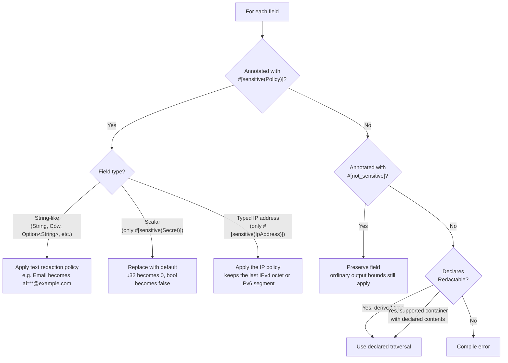
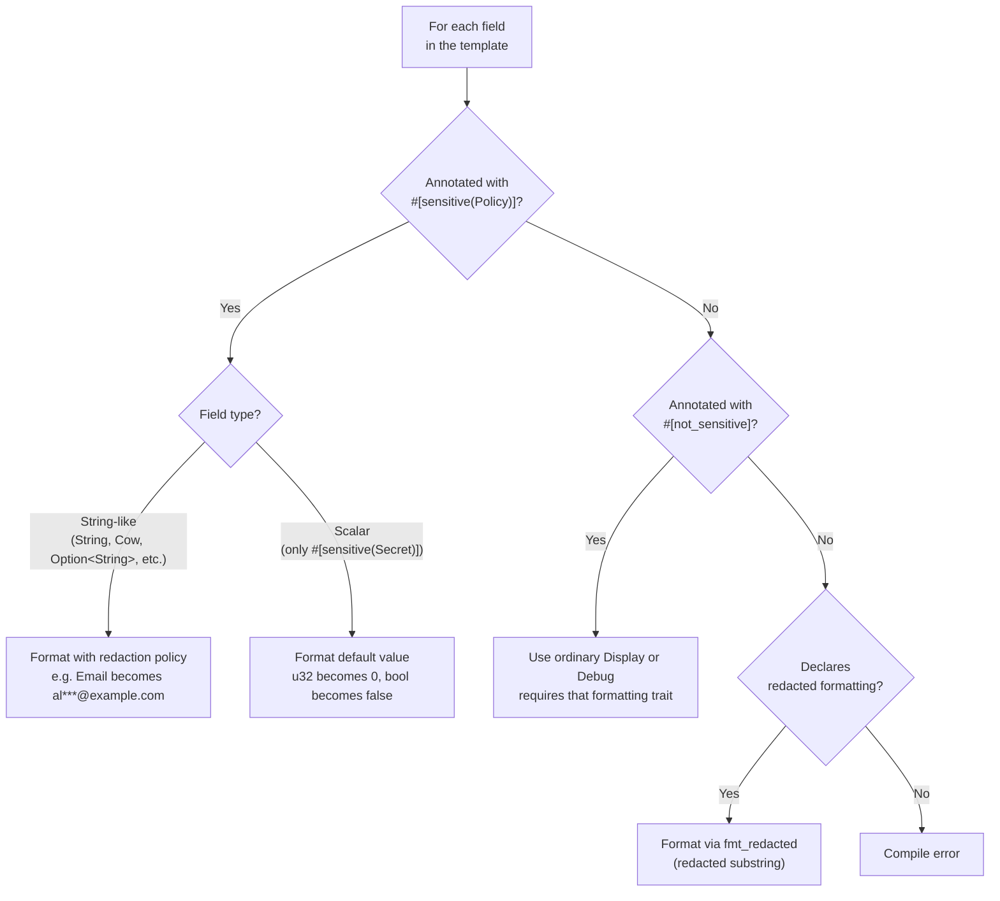

# Redactable

`redactable` is a redaction library for Rust. It lets you mark sensitive data in
your structs and enums and produce redacted values for logging and telemetry.
Redaction is not tied to any logging framework.

## Contents

- [Getting started](#getting-started)
- [Design principles](#design-principles)
- [How Sensitive works](#how-sensitive-works)
- [How SensitiveDisplay works](#how-sensitivedisplay-works)
- [When you need both: SensitiveDual](#when-you-need-both-sensitivedual)
- [NotSensitive and NotSensitiveDisplay](#notsensitive-and-notsensitivedisplay)
- [Wrapper types](#wrapper-types)
- [Integrations](#integrations)
- [Logging safety](#logging-safety)
- [Choosing what to use](#choosing-what-to-use)
- [Policies and reference](#policies-and-reference)

## Getting started

Which derive to use depends on what you need back: a structured value or
formatted text.

Use `Sensitive` when you want to keep working with the original type.
`.redact()` turns a `User` into a `User` with its sensitive fields redacted.
You can then serialize that value or pass it to another part of your application.

Use `SensitiveDisplay` when you need text, such as an error message or a log line.
You write a template, and the derive formats its fields with redaction applied.
`.redacted_display()` gives you a view you can format directly or turn into a
`String` with `.to_string()`.

If you need both, [SensitiveDual](#when-you-need-both-sensitivedual) combines the
two derives. The [choosing guide](#choosing-what-to-use) also covers non-sensitive
types and logging adapters.

### Quick examples

Redactable 0.12 requires Rust 1.97 or later. The structured example also uses
Serde to make the redacted value serializable:

```toml
[dependencies]
redactable = "0.12"
serde = { version = "1", features = ["derive"] }
```

**Structured** (`Sensitive`), with a redacted copy:

`.redact()` consumes its input. Clone first when you want to keep the original,
as this example does:

```rust
use redactable::{Email, Redactable, Sensitive};

#[derive(Clone, Sensitive, serde::Serialize)]
struct User {
    #[not_sensitive]
    name: String,
    #[sensitive(Email)]
    email: String,
}

let user = User { name: "alice".into(), email: "alice@example.com".into() };
let redacted = user.clone().redact();
assert_eq!(redacted.name, "alice");
assert_eq!(redacted.email, "al***@example.com");
```

**Formatted text** (`SensitiveDisplay`):

```rust
use redactable::{RedactableWithFormatter, Secret, SensitiveDisplay};

#[derive(SensitiveDisplay)]
enum AuthError {
    #[error("login failed for {user} with {password}")]
    InvalidCredentials {
        #[not_sensitive]
        user: String,
        #[sensitive(Secret)]
        password: String,
    },
}

let err = AuthError::InvalidCredentials {
    user: "alice".into(),
    password: "hunter2".into(),
};
assert_eq!(
    err.redacted_display().to_string(),
    "login failed for alice with [REDACTED]"
);
```

## Design principles

The library follows three principles:

1. **You decide what each field may reveal.** Apply a policy with
   `#[sensitive(Policy)]`, or declare a public field with `#[not_sensitive]`.
   A nested type can make those decisions for its own fields by deriving redaction.
2. **Traversal is automatic.** An `Option<User>` delegates to its `User`, and a
   `Vec<User>` visits each user. You do not write the traversal yourself.
3. **Both paths use the same annotations.** The policy on a field means the same
   thing whether you need a redacted value or formatted text.

A plain `String` does not tell the compiler whether it holds a password or a
public message. That is why raw fields need an explicit decision.
An undecided raw field fails to compile when structural traversal or a template references it.

### What redaction protects

Redaction applies when you use a redacted API or a generated logging integration.
Accessing `user.email` still gives you the original field. Serializing `user`
directly still gives you the original data, too: APIs and databases often need it.
For redacted serialization, redact the value first or use `.to_redacted().json()`.

A policy can preserve part of a value, such as an email domain or token suffix.
Choose a policy that reveals only what your logs should contain.
Generated `Debug` keeps its production redaction in tests and with the `testing`
feature enabled.

There are differences between traversal, generated `Debug`, and individual
logging adapters. The sections below show their output; the
[reference](docs/reference.md) covers ownership, borrowing, and type restrictions.

## How Sensitive works

`Sensitive` walks a struct or enum field by field. It requires `Clone + Serialize`
and returns a value of the same type. The containing type must not implement
[`Drop`](docs/reference.md#types-that-implement-drop).

Each field tells it what to do:

| Field | What happens |
|---|---|
| `#[sensitive(Policy)]` | Apply the policy to the value, including through supported containers |
| `#[not_sensitive]` | Keep the whole field unchanged, including any nested sensitive data |
| A nested type deriving `Sensitive` | Walk that type's fields and apply its annotations |
| A supported container such as `Option<T>` or `Vec<T>` | Delegate to its contents, which must also declare redaction behavior |
| A raw field with no declaration | Compile error |

For example, `Address` below declares what to do with its fields. `Account`
does not, so the `account` field makes this example fail to compile:

```rust,compile_fail
use redactable::{Sensitive, Token};

#[derive(Clone, Sensitive, serde::Serialize)]
struct Address {
    #[not_sensitive]
    city: String,
}

#[derive(Clone, Debug, serde::Serialize)]
struct Account {  // Does NOT derive Sensitive
    password: String,
}

#[derive(Clone, Sensitive, serde::Serialize)]
struct User {
    address: Address,       // ✅ container, walks into it
    #[not_sensitive]
    name: String,           // ✅ explicitly public, unchanged
    #[sensitive(Token)]
    api_key: String,        // ✅ annotated leaf, policy applied (redacted)
    account: Account,       // ❌ ERROR: Account does not declare Redactable behavior
}
```

### How nested values compose

The traversal code uses `RedactableWithMapper` to work with different types
through one interface. Containers delegate to their contents; standard leaves
such as `String` and `u32` provide a no-op implementation.

That low-level implementation is not a decision about sensitivity. The derive
also requires `Redactable` on unannotated fields, so a raw `String` still needs a
policy or `#[not_sensitive]`.

Here is what that means for nested values. An explicitly public `Option<String>`
stays unchanged, while an `Option<Inner>` lets `Inner` redact its own secret:

```rust
use redactable::{Redactable, Secret, Sensitive};

#[derive(Clone, Sensitive, serde::Serialize)]
struct Inner {
    #[sensitive(Secret)]
    secret: String,
}

#[derive(Clone, Sensitive, serde::Serialize)]
struct Outer {
    #[not_sensitive]
    name: String,                   // explicitly public, unchanged
    #[not_sensitive]
    age: u32,                       // explicitly public, unchanged
    #[not_sensitive]
    maybe_string: Option<String>,   // explicit passthrough of the whole option
    maybe_inner: Option<Inner>,     // Option delegates; Inner is walked and redacted
    #[sensitive(Secret)]
    secret: Option<String>,         // #[sensitive(Secret)] applies through the Option
}

let outer = Outer {
    name: "alice".into(),
    age: 30,
    maybe_string: Some("visible".into()),
    maybe_inner: Some(Inner { secret: "hidden".into() }),
    secret: Some("also_hidden".into()),
};
let redacted = outer.redact();

assert_eq!(redacted.name, "alice");                               // unchanged
assert_eq!(redacted.age, 30);                                     // unchanged
assert_eq!(redacted.maybe_string, Some("visible".into()));        // unchanged
assert_eq!(redacted.maybe_inner.unwrap().secret, "[REDACTED]");   // walked and redacted
assert_eq!(redacted.secret, Some("[REDACTED]".into()));           // policy applied
```

### What if a field has no redaction declaration?

For a raw leaf, choose a policy or `#[not_sensitive]`. For a type containing its
own fields, the choice depends on whether you own the type:

- **Local types:** derive `Sensitive` on the type so it participates in traversal:

  ```rust
  use redactable::Sensitive;

  #[derive(Clone, Sensitive, serde::Serialize)]
  struct Account { /* ... */ }  // now implements RedactableWithMapper
  ```

- **Foreign types:** if the whole field is public, use `#[not_sensitive]`.
  For example, with a timeout type from another crate:

  ```rust,ignore
  use external_crate::Timeout;

  #[derive(Clone, Sensitive, serde::Serialize)]
  struct Config {
      #[not_sensitive]
      timeout: Timeout,  // skips RedactableWithMapper entirely
  }
  ```

  `#[not_sensitive]` is the declaration for a non-sensitive foreign field. When the foreign value is sensitive, [Wrapper types for foreign types](#foreign-types) shows the `SensitiveValue<T, P>` route.

### The `#[sensitive(Policy)]` attribute

`#[sensitive(Policy)]` tells the derive how to transform a field. The policy
also applies through supported containers, such as an `Option<String>`:

- `#[sensitive(Secret)]` on scalars: replaces the value with a default (0, false, `'*'`)
- `#[sensitive(Secret)]` on strings: replaces with `"[REDACTED]"`
- `#[sensitive(Policy)]` on strings: applies the policy's redaction rules

```rust
use redactable::{Email, Secret, Sensitive};

#[derive(Clone, Sensitive, serde::Serialize)]
struct Login {
    #[not_sensitive]
    username: String,           // explicitly public, unchanged
    #[sensitive(Secret)]
    password: String,           // redacted to "[REDACTED]"
    #[sensitive(Email)]
    email: String,              // redacted to "al***@example.com"
    #[sensitive(Secret)]
    attempts: u32,              // redacted to 0
}
```

`#[sensitive(Secret)]` accepts both bare primitive names such as `u32` and qualified standard-library paths such as `std::primitive::u32`.

### How the Sensitive macro processes each field


```mermaid
flowchart TD
    F["For each field"] --> A{"Annotated with<br/>#[sensitive(Policy)]?"}
    A -- Yes --> T{"Field type?"}
    T -- "String-like<br/>(String, Cow, Option&lt;String&gt;, etc.)" --> B["Apply text redaction policy<br/>e.g. Email becomes al***@example.com"]
    T -- "Scalar<br/>(only #[sensitive(Secret)])" --> C["Replace with default<br/>u32 becomes 0, bool becomes false"]
    T -- "Typed IP address<br/>(only #[sensitive(IpAddress)])" --> C2["Apply the IP policy<br/>keeps the last IPv4 octet or IPv6 segment"]
    A -- No --> D{"Annotated with<br/>#[not_sensitive]?"}
    D -- Yes --> E["Preserve field<br/>ordinary output bounds still apply"]
    D -- No --> G{"Declares<br/>Redactable?"}
    G -- "Yes, derived type" --> I["Use declared traversal"]
    G -- "Yes, supported container<br/>with declared contents" --> I
    G -- No --> K["Compile error"]
```

## How SensitiveDisplay works

`SensitiveDisplay` starts from a template. It formats only the fields the template
references; omitted fields never appear in that text.

This is useful for errors. An error can hold a connection, a retry context, and
credentials, while its message includes just a redacted account name.

The derive implements `RedactableWithFormatter` and formats by reference.
The generated text/secret path needs no `Clone`. Some policy projections have
extra requirements, described in the [reference](docs/reference.md#supported-types).

- A policy redacts a field before formatting it.
- `#[not_sensitive]` uses the field's ordinary `Display` or `Debug` implementation.
- A nested type can supply its own declared redacted formatting.
- A raw field referenced without a declaration produces a compile error.

In this example, `InnerError` supplies its own redacted text. `ExternalContext`
only implements ordinary `Display`, so the `ctx` field makes compilation fail:

```rust,compile_fail
use redactable::{RedactableWithFormatter, Secret, SensitiveDisplay};
use std::fmt::{Display, Formatter, Result as FmtResult};

#[derive(SensitiveDisplay)]
enum InnerError {
    #[error("db password {password}")]
    Database {
        #[sensitive(Secret)]
        password: String,
    },
}

struct ExternalContext;  // Does NOT derive SensitiveDisplay
impl Display for ExternalContext {
    fn fmt(&self, f: &mut Formatter<'_>) -> FmtResult {
        f.write_str("external")
    }
}

#[derive(SensitiveDisplay)]
enum AppError {
    #[error("user {name} (attempt {count})")]
    UserError {
        #[not_sensitive]
        name: String,              // ✅ explicitly public text
        #[not_sensitive]
        count: u32,                // ✅ explicitly public count
    },

    #[error("auth: {password}")]
    AuthFailed {
        #[sensitive(Secret)]
        password: String,          // ✅ annotated, becomes "[REDACTED]"
    },

    #[error("caused by: {source}")]
    Nested {
        source: InnerError,        // ✅ nested type, redacted via RedactableWithFormatter
    },

    #[error("context: {ctx}")]
    WithContext {
        ctx: ExternalContext,      // ❌ ERROR: missing declared redacted formatting
    },
}

let err = AppError::UserError { name: "alice".into(), count: 3 };
assert_eq!(err.redacted_display().to_string(), "user alice (attempt 3)"); // scalars unchanged

let err = AppError::AuthFailed { password: "hunter2".into() };
assert_eq!(err.redacted_display().to_string(), "auth: [REDACTED]"); // policy applied

let err = AppError::Nested {
    source: InnerError::Database { password: "secret".into() },
};
assert_eq!(
    err.redacted_display().to_string(),
    "caused by: db password [REDACTED]"
); // nested redaction
```

### Template syntax

The display template comes from one of two sources:

**`#[error("...")]` attribute** (thiserror-style):

```rust
use redactable::SensitiveDisplay;

#[derive(SensitiveDisplay)]
enum ApiError {
    #[error("auth failed for {user}")]
    AuthFailed { #[not_sensitive] user: String },
}
```

**Doc comment** (same syntax as `displaydoc`, but parsed by the macro itself):

```rust
use redactable::SensitiveDisplay;

#[derive(SensitiveDisplay)]
enum ApiError {
    /// auth failed for {user}
    AuthFailed { #[not_sensitive] user: String },
}
```

Both support named placeholders (`{field_name}`), positional placeholders (`{0}`, `{1}`), and debug formatting (`{field:?}`).

`{field:?}` on a declared unannotated field uses redacted-display semantics.
An explicitly public field uses ordinary `Debug`, including string quotes and
escaping. Migrating a former raw `String` to `#[not_sensitive]` therefore adds
quotes with `:?`; choose `{field}` when plain public text is intended.

Positional placeholders must be contiguous from `0`; `{1}` without `{0}` is
rejected. Dynamic width or precision, such as `{value:.*}`, and non-Display or
Debug specifiers, such as `{value:x}`, are also rejected.

### Why referenced fields need a declaration

Being able to format a value does not tell the compiler whether it is safe to
include. Standard strings and scalars provide the low-level formatting machinery,
but referenced raw fields still need a policy or `#[not_sensitive]`.
Containers pass that requirement on to their contents.

Constant templates and omitted fields need no declaration. `SensitiveDual` also
checks every structural field, including fields its template omits.
See the [manual formatter contract](docs/reference.md#manual-formatters) for
handwritten implementations.

For public fields, the declaration makes the intended output explicit:

```rust
use redactable::{RedactableWithFormatter, SensitiveDisplay};

#[derive(SensitiveDisplay)]
enum Event {
    #[error("user {name} (age {age}, active: {active})")]
    UserInfo {
        #[not_sensitive]
        name: String,       // formats as "alice"
        #[not_sensitive]
        age: u32,           // formats as "30"
        #[not_sensitive]
        active: bool,       // formats as "true"
    },
}

let event = Event::UserInfo { name: "alice".into(), age: 30, active: true };
assert_eq!(
    event.redacted_display().to_string(),
    "user alice (age 30, active: true)"
);
```

### What if a field has no redacted formatter?

If a referenced field has no declared redacted formatter, compilation fails.
For raw leaves, choose a policy or `#[not_sensitive]`. For other types:

- **Local types:** derive `SensitiveDisplay` on the type so it participates in redacted formatting:

  ```rust
  use redactable::SensitiveDisplay;

  #[derive(SensitiveDisplay)]
  enum DatabaseError {
      #[error("connection failed: {detail}")]
      Connection { #[not_sensitive] detail: String },
  }
  // Now DatabaseError implements RedactableWithFormatter
  ```

- **Foreign types:** if the field is public, use `#[not_sensitive]` to render
  its ordinary `Display`. For example, with a context type from another crate:

  ```rust,ignore
  use external_crate::ErrorContext;

  #[derive(SensitiveDisplay)]
  enum AppError {
      #[error("context: {ctx}")]
      WithContext {
          #[not_sensitive]
          ctx: ErrorContext,  // renders via Display, skips RedactableWithFormatter
      },
  }
  ```

  `#[not_sensitive]` is the declaration for a non-sensitive foreign field. See [Wrapper types for foreign types](#foreign-types) for the sensitive case.

### The `#[sensitive(Policy)]` attribute in templates

`#[sensitive(Policy)]` has the same policy behavior as `Sensitive`, but formats
the result into the template:

- `#[sensitive(Secret)]` on strings: replaces with `"[REDACTED]"`
- `#[sensitive(Secret)]` on scalars: replaces with the default value (`0`, `false`, `'*'`)
- `#[sensitive(Policy)]` on strings: applies the policy's redaction rules
- `#[sensitive(Policy)]` on containers such as `Option<String>` or `Vec<String>`: applies the policy to each contained string, then formats the redacted container in the template

```rust
use redactable::{Email, RedactableWithFormatter, Secret, SensitiveDisplay, Token};

#[derive(SensitiveDisplay)]
enum AuthEvent {
    #[error("login by {email} with token {token} (attempt {attempt})")]
    Login {
        #[sensitive(Email)]
        email: String,              // becomes "al***@example.com"
        #[sensitive(Token)]
        token: String,              // becomes "***********2345"
        #[sensitive(Secret)]
        attempt: u32,               // becomes 0
    },
}

let event = AuthEvent::Login {
    email: "alice@example.com".into(),
    token: "sk-secret-12345".into(),
    attempt: 3,
};
assert_eq!(
    event.redacted_display().to_string(),
    "login by al***@example.com with token ***********2345 (attempt 0)"
);
```

### How the SensitiveDisplay macro processes each field


```mermaid
flowchart TD
    F["For each field<br/>in the template"] --> A{"Annotated with<br/>#[sensitive(Policy)]?"}
    A -- Yes --> T{"Field type?"}
    T -- "String-like<br/>(String, Cow, Option&lt;String&gt;, etc.)" --> B["Format with redaction policy<br/>e.g. Email becomes al***@example.com"]
    T -- "Scalar<br/>(only #[sensitive(Secret)])" --> C["Format default value<br/>u32 becomes 0, bool becomes false"]
    A -- No --> D{"Annotated with<br/>#[not_sensitive]?"}
    D -- Yes --> E["Use ordinary Display or Debug<br/>requires that formatting trait"]
    D -- No --> G{"Declares<br/>redacted formatting?"}
    G -- Yes --> I["Format via fmt_redacted<br/>(redacted substring)"]
    G -- No --> K["Compile error"]
```

## When you need both: SensitiveDual

Sometimes the same type needs structured fields in one log and a short message
in another. Derive `SensitiveDual` to generate both paths from the same annotations.

Like `Sensitive`, it checks every field and requires `Clone + Serialize`.
Like `SensitiveDisplay`, it also needs a template. Fields omitted from that
template still participate in structured redaction.

```rust
use redactable::{Email, SensitiveDual, ToRedacted};

#[derive(Clone, SensitiveDual, serde::Serialize)]
#[error("login by {email}")]
struct Login {
    #[sensitive(Email)]
    email: String,
    #[not_sensitive]
    accepted: bool,
}

let login = Login { email: "alice@example.com".into(), accepted: true };
let output = login.to_redacted();
assert_eq!(output.text(), "login by al***@example.com");
assert_eq!(output.json()["email"], "al***@example.com");
assert_eq!(output.json()["accepted"], true);
```

`.redacted_display()` returns the template view. `.slog_redacted()` and
`.tracing_redacted()` use the template; `.slog_redacted_json()` uses the object.

## NotSensitive and NotSensitiveDisplay

A public type still needs to tell the redaction system that it is public.
That lets it compose with sensitive types and pass the same logging bounds.

For types you own, use `NotSensitive` for structured data or
`NotSensitiveDisplay` for a type with a public `Display` representation.
Both preserve the value during traversal and generate the enabled logging
integrations. Neither generates `Debug`; derive it separately if you need it.

These declarations apply to the whole type. They do not inspect its fields to
check whether your decision is correct.

### `NotSensitive`

`NotSensitive` is for types with no sensitive data that need to work inside `Sensitive` containers:

```rust
use redactable::{NotSensitive, Secret, Sensitive};

#[derive(Clone, Debug, NotSensitive, serde::Serialize)]
struct PublicMetadata {
    version: String,
    timestamp: u64,
}

#[derive(Clone, Sensitive, serde::Serialize)]
struct Config {
    #[sensitive(Secret)]
    api_key: String,
    metadata: PublicMetadata,  // ✅ NotSensitive provides RedactableWithMapper
}
```

### `NotSensitiveDisplay`

`NotSensitiveDisplay` is for types with no sensitive data that have a `Display` impl:

```rust
use std::fmt::{Display, Formatter, Result as FmtResult};
use redactable::NotSensitiveDisplay;

/// Retry using backoff
#[derive(Clone, NotSensitiveDisplay)]
enum RetryDecision {
    Retry { delay_ms: u64 },
    Abort,
}

impl Display for RetryDecision {
    fn fmt(&self, f: &mut Formatter<'_>) -> FmtResult {
        match self {
            Self::Retry { delay_ms } => write!(f, "Retry after {}ms", delay_ms),
            Self::Abort => write!(f, "Abort"),
        }
    }
}
```

`NotSensitiveDisplay` works inside both `Sensitive` and `SensitiveDisplay`
containers. It uses the type's own `Display` implementation for text and leaves
it unchanged during structural traversal.

You can also derive the public `Display` implementation with `displaydoc`.
Add it as a dependency to use this version:

```rust,ignore
use redactable::NotSensitiveDisplay;

#[derive(Clone, displaydoc::Display, NotSensitiveDisplay)]
enum RetryDecision {
    /// Retry using backoff
    Retry,
    /// Do not retry
    Abort,
}
// Now RetryDecision has Display (from displaydoc), RedactableWithFormatter, slog::Value, etc.
```

## Wrapper types

An attribute changes how the containing type redacts a field. A wrapper changes
the field's runtime type, so it can carry its policy wherever you pass it.

`SensitiveValue<T, P>` wraps a value with a policy. It provides redacted `Debug`,
`.redacted()` for the redacted form, and `.expose()` for deliberate raw access.
It has no `Display` implementation, so accidental `{}` formatting does not compile.
It also implements `ToRedacted` and the enabled slog/tracing integrations.

The `Bypass*` wrappers make an explicit public-data declaration. They are useful
for foreign values or APIs that require a redaction trait on the value itself.
For a public field in a type you own, `#[not_sensitive]` is usually enough.

### Choosing a wrapper

Choose a bypass wrapper only when its entire output is public. For a record
that mixes public and sensitive fields, use a sensitive derive or a separate
type containing just the fields you intend to log.

| Need | Use |
|---|---|
| Sensitive leaf with a policy | `SensitiveValue<T, P>` |
| Sensitive structured output | `Sensitive` or `SensitiveDual`; the derive produces the JSON |
| Restricted summary or selected shape | A log-view type deriving the shape you want, or `BypassTextRedaction` for author-composed text |
| Public value logged with `Debug` | `BypassDebugRedaction<T>` |
| Public value logged with `Display` | `BypassDisplayRedaction<T>` |
| Borrowed value logged as raw JSON | `BypassJsonRedaction<'_, T>` |
| Foreign value at a `Redactable`-bounded boundary | `BypassRedaction<T>` |
| Public value using slog's native typed output, even without `Display` or `Debug` | `BypassRedactionMarker<T>` |

Bypass wrappers use tuple construction: `BypassJsonRedaction(&value)` or
`BypassTextRedaction(text)`. `BypassRedaction` and `BypassRedactionMarker` do not
implement `ToRedacted`, because neither chooses a logging format.
The [wrapper reference](docs/reference.md#wrapper-contracts) lists their traits and accessors.

`BypassDebugRedaction`, `BypassDisplayRedaction`, and `BypassRedaction` serialize
and deserialize exactly like their inner value. Sensitive wrappers also preserve
raw data for transport and storage; their policy applies at the logging boundary.

For example, this serialization keeps the original string. It needs
`serde_json = "1"` as a direct dependency:

```rust
use redactable::{Secret, SensitiveValue, ToRedacted};

let token = SensitiveValue::<String, Secret>::from("secret".to_owned());
assert_eq!(serde_json::to_value(&token).unwrap(), serde_json::json!("secret"));
assert_eq!(token.to_redacted().text(), "[REDACTED]");
```

### Foreign types

Types from other crates cannot use your derives, and the orphan rule prevents
you from implementing redactable's traversal traits for them. Wrappers provide
those implementations. A local policy type can implement
`SensitiveWithPolicy<P>` for the foreign value.

For a sensitive foreign type, define a [local policy](#custom-policies),
implement `SensitiveWithPolicy<P>`, and use `SensitiveValue`:

```rust
use redactable::{
    RedactionPolicy, Sensitive, SensitiveValue, SensitiveWithPolicy, TextPolicyKind,
    TextRedactionPolicy,
};

// Imagine this comes from a payments SDK.
// It exposes accessors but no redaction support.
#[derive(Clone, Debug, serde::Serialize)]
struct MerchantAccount {
    id: String,
    name: String,
    tax_id: String,
}

impl MerchantAccount {
    fn tax_id(&self) -> &str { &self.tax_id }
}

// The policy type must be local to your crate: that is what satisfies the
// orphan rule for the SensitiveWithPolicy impl on the foreign type.
#[derive(Clone, Copy)]
struct MerchantPii;

impl RedactionPolicy for MerchantPii {
    type Kind = TextPolicyKind;

    fn policy() -> TextRedactionPolicy {
        TextRedactionPolicy::keep_last(2)
    }
}

impl SensitiveWithPolicy<MerchantPii> for MerchantAccount {
    fn redact_with_policy(self, policy: &TextRedactionPolicy) -> Self {
        Self {
            id: self.id,
            name: policy.apply_to(&self.name),
            tax_id: policy.apply_to(&self.tax_id),
        }
    }
    fn redacted_string(&self, policy: &TextRedactionPolicy) -> String {
        format!("MerchantAccount({}, {})", policy.apply_to(&self.name), policy.apply_to(&self.tax_id))
    }
}

#[derive(Clone, Sensitive, serde::Serialize)]
struct PaymentConfig {
    merchant: SensitiveValue<MerchantAccount, MerchantPii>,
}
```

The example below shows both halves of the rule: a non-sensitive foreign field
declared with `#[not_sensitive]`, and `BypassRedaction<T>` at an API that
demands `Redactable` on the foreign value itself.

```rust
use redactable::{BypassRedaction, Redactable, Sensitive};

#[derive(Clone, Debug, serde::Serialize)]
struct ForeignConfig { timeout: u64 }  // (pretend this is from another crate)

#[derive(Clone, Sensitive, serde::Serialize)]
struct AppConfig {
    #[not_sensitive]
    foreign: ForeignConfig,  // passes through unchanged
}

// A boundary that bounds the value itself, not a field of yours:
fn store<T: Redactable>(value: T) -> T { value.redact() }

let kept = store(BypassRedaction(ForeignConfig { timeout: 30 }));
assert_eq!(kept.0.timeout, 30);
```

### Protecting individual fields

With an attribute, a `String` is still a `String`. Logging `user.email` directly
can expose it even when logging the containing `user` would redact it.

`SensitiveValue<T, P>` follows the field wherever it goes. Its `Debug` uses the
policy, and `.expose()` gives you deliberate access to the original value.
Use either an attribute on a bare field or an unannotated `SensitiveValue` field.

With your application's logger configured:

```rust,ignore
#[derive(Clone, Sensitive, serde::Serialize)]
struct User {
    email: SensitiveValue<String, Pii>,  // The value IS a wrapper, not a bare String
}

let user = User { email: SensitiveValue::from(String::from("alice@example.com")) };

// ✅ Safe: Debug shows the policy-redacted value, not the raw email
log::info!("Email: {:?}", user.email);

// ✅ Safe: explicit call for redacted form
log::info!("Email: {}", user.email.redacted());

// ⚠️ Intentional: .expose() for raw access (code review catches this)
let raw = user.email.expose();
```

Compare with `#[sensitive(P)]` attributes, where the field is a bare type at runtime:

| | `#[sensitive(P)]` | `SensitiveValue<T, P>` |
|---|---|---|
| **Ergonomics** | ✅ Work with actual types | ❌ Need `.expose()` everywhere |
| **Display (`{}`)** | Shows raw value | ✅ Not implemented (won't compile) |
| **Debug (`{:?}`)** | Shows raw value | ✅ Shows policy-redacted value |
| **Serialization** | Shows raw value | Shows raw value |
| **slog/tracing safety** | ✅ Via container | ✅ Direct |

The attribute affects output generated for the containing type, not direct
formatting of the field. `Sensitive`'s generated `Debug` uses the generic
`[REDACTED]` placeholder. `SensitiveDisplay` and the display-selected `Debug`
generated by `SensitiveDual` use the declared template, so policy annotations
may preserve shaped fragments such as an email domain or token suffix.

Both forms serialize raw values. Use `.redact()` or `.to_redacted()` when the
serialized boundary must be redacted.
`SensitiveValue` is a leaf wrapper and does not walk nested field annotations.
Local structured types should derive `Sensitive` instead.

## Integrations

### slog

The `slog` feature makes derived types and `SensitiveValue` implement
`slog::Value`, so you can pass them to slog directly:

```toml
[dependencies]
redactable = { version = "0.12", features = ["slog"] }
serde = { version = "1", features = ["derive"] }
slog = "2.8"
```

Structured slog output relies on nested-value support throughout the drain
stack. When using drains such as `slog-async` or `slog-json`, enable each
drain crate's `nested-values` feature as well. Enabling `redactable/slog`
enables the feature on `slog` itself, but not on separate drain crates.

**Containers**: the `Sensitive` derive generates `slog::Value` automatically:

```rust
use redactable::{CreditCard, Email, Sensitive};
use serde::Serialize;
use slog::{Discard, Logger};

#[derive(Clone, Sensitive, Serialize)]
struct PaymentEvent {
    #[sensitive(Email)]
    customer_email: String,
    #[sensitive(CreditCard)]
    card_number: String,
    #[not_sensitive]
    amount: u64,
}

let event = PaymentEvent {
    customer_email: "alice@example.com".into(),
    card_number: "4111111111111234".into(),
    amount: 9999,
};

// Just log it - slog::Value impl handles redaction automatically
let logger = Logger::root(Discard, slog::o!());
slog::info!(logger, "payment"; "event" => &event);
// Borrowed generated output: "[REDACTED]"
```

**Leaf wrappers**: `SensitiveValue<T, P>` also implements `slog::Value`:

```rust
use redactable::{SensitiveValue, Token};
use slog::{Discard, Logger};

let api_token: SensitiveValue<String, Token> = SensitiveValue::from(String::from("sk-secret-key"));

// Also automatic - SensitiveValue has its own slog::Value impl
let logger = Logger::root(Discard, slog::o!());
slog::info!(logger, "auth"; "token" => &api_token);
// Logged: "*********-key"
```

Both work because they implement `slog::Value`. The derive supplies that
implementation for containers; the wrapper supplies its own.

The direct borrowed `Sensitive` and `SensitiveDual` implementations emit
`"[REDACTED]"`. To log the redacted fields as JSON, use `.slog_redacted_json()`.
That adapter clones the value, redacts the clone, and emits its JSON.

`SensitiveDisplay` emits its redacted text. The public-data derives emit what you
declared public: raw JSON for `NotSensitive`, or raw `Display` text for
`NotSensitiveDisplay`.

### tracing

For structural values with any tracing subscriber, use the plain `tracing`
feature and log the redacted `Debug` form:

```toml
[dependencies]
redactable = { version = "0.12", features = ["tracing"] }
serde = { version = "1", features = ["derive"] }
tracing = "0.1"
```

With your application's tracing subscriber configured:

```rust,ignore
use redactable::{Email, Sensitive, Token};
use redactable::tracing::TracingRedactedDebugExt;

#[derive(Clone, Sensitive, serde::Serialize)]
struct AuthEvent {
    #[sensitive(Token)]
    api_key: String,
    #[sensitive(Email)]
    user_email: String,
    #[not_sensitive]
    action: String,
}

let event = AuthEvent {
    api_key: "sk-secret-key-12345".into(),
    user_email: "alice@example.com".into(),
    action: "login".into(),
};

// Redacts a clone before the value reaches the tracing subscriber.
tracing::info!(event = event.tracing_redacted_debug());
// Production output: AuthEvent { api_key: "[REDACTED]", user_email: "[REDACTED]", action: "login" }
```

These policy fields use the full `[REDACTED]` placeholder in generated `Debug`,
including in tests and with the `testing` feature.

For typed structured logging, use the `valuable` integration. Upstream tracing
requires `RUSTFLAGS="--cfg tracing_unstable"` for `tracing::field::valuable`,
and the field expression must pass a reference through that adapter:

```toml
[dependencies]
redactable = { version = "0.12", features = ["tracing-valuable"] }
serde = { version = "1", features = ["derive"] }
tracing = "0.1"
valuable = { version = "0.1", features = ["derive"] }
```

Build this example with `RUSTFLAGS="--cfg tracing_unstable"`:

```rust,ignore
use redactable::{Email, Sensitive, Token};
use redactable::tracing::TracingValuableExt;

#[derive(Clone, Sensitive, serde::Serialize, valuable::Valuable)]
struct AuthEvent {
    #[sensitive(Token)]
    api_key: String,
    #[sensitive(Email)]
    user_email: String,
    #[not_sensitive]
    action: String,
}

let event = AuthEvent {
    api_key: "sk-secret-key-12345".into(),
    user_email: "alice@example.com".into(),
    action: "login".into(),
};

let redacted = event.tracing_redacted_valuable();
tracing::info!(event = tracing::field::valuable(&redacted));
// Logged: {api_key: "***************2345", user_email: "al***@example.com", action: "login"}
```

Unlike slog where `slog::Value` can be implemented automatically via the derive
macro, tracing's `Value` trait is sealed. The `valuable` crate provides the
structured data path, but `TracingRedactedValue<T>` is not itself a tracing field
value. `.tracing_redacted_valuable()` redacts first; `tracing::field::valuable`
adapts the binding for subscribers that support `valuable`.

**For flat display values** (without `valuable`):

```rust,ignore
use redactable::{Email, SensitiveValue, Token};
use redactable::tracing::TracingRedactedExt;

let api_key: SensitiveValue<String, Token> = SensitiveValue::from(String::from("sk-secret-key-12345"));
let user_email: SensitiveValue<String, Email> = SensitiveValue::from(String::from("alice@example.com"));

tracing::info!(
    api_key = api_key.tracing_redacted(),
    user_email = user_email.tracing_redacted(),
    action = "login"
);
// Logged: api_key="***************2345" user_email="al***@example.com" action="login"
```

The display path also works for `SensitiveDisplay`, `SensitiveDual`,
`NotSensitiveDisplay`, and other values that implement `ToRedacted`.

## Logging safety

The integrations redact values when you use their adapters. Your own logging
helpers can require those adapters too, making an accidental raw value a compile error.

### Enforcing redaction at compile time

`SlogRedacted` and `TracingRedacted` mark values with logging integrations that
respect their redaction declarations. The five derives and `SensitiveValue`
implement them when the corresponding feature is enabled.

Requiring a marker is only useful if the helper also uses the correct adapter.
A helper that checks the bound and then formats a raw field can still leak data.

`BypassRedactionMarker` explicitly declares its wrapped value public. It implements
`TracingRedacted`, and also `SlogRedacted` when the wrapped value implements
`slog::Value`. The raw value itself remains unmarked.

For slog, use `SlogRedacted` with `slog::Value` and pass the value to slog's
field API:

With `user`, `api_token`, and your logger supplied by the application, the
first two calls compile. The raw email call is deliberately rejected:

```rust,ignore
use redactable::slog::SlogRedacted;

macro_rules! slog_safe {
    ($logger:expr, $msg:literal; $($key:literal => $value:expr),* $(,)?) => {{
        fn assert_slog_safe<T: SlogRedacted + slog::Value>(_: &T) {}
        $(assert_slog_safe(&$value);)*
        slog::info!($logger, $msg; $($key => &$value),*);
    }};
}

// ✅ Works: Sensitive-derived types implement SlogRedacted
slog_safe!(logger, "user logged in"; "user" => &user);

// ✅ Works: SensitiveValue implements SlogRedacted
slog_safe!(logger, "auth"; "token" => &api_token);  // SensitiveValue<String, Token>

// ❌ Won't compile: raw String doesn't implement SlogRedacted
slog_safe!(logger, "user"; "email" => &user.email);
```

For structural tracing fields, require the redacting extension trait and call
its adapter:

```rust,ignore
use redactable::tracing::TracingRedactedDebugExt;

macro_rules! trace_safe {
    ($($key:ident = $value:expr),* $(,)?) => {{
        fn assert_tracing_safe<T: TracingRedactedDebugExt>(_: &T) {}
        $(assert_tracing_safe(&$value);)*
        tracing::info!($($key = $value.tracing_redacted_debug()),*);
    }};
}
```

### `ToRedacted` for custom pipelines

A custom logger needs one common input even when some types produce text and
others produce structured data. `ToRedacted` provides that input.
Its `.to_redacted()` method returns an owned `RedactedValue` that the logger
can read as text or JSON.

- `text()` returns the redacted text, or compact JSON when only JSON is available.
- `json()` returns the redacted JSON, or `{"message": text}` for a text-only value.
- `SensitiveDual` supplies both representations from the same call.

The five derives generate `ToRedacted` for you. The logger chooses its format
without needing to know which derive the application used.

A `Sensitive` type always produces JSON. On serialization failure, the JSON is
the fixed string `"[REDACTED]"`; serializer errors and input data are never
included.

This logger accepts any `ToRedacted` value. The example also reads its JSON
representation, so add `serde_json = "1"` as a direct dependency:

```rust
use redactable::{BypassDisplayRedaction, Email, Sensitive, ToRedacted};
use serde::Serialize;

#[derive(Clone, Sensitive, Serialize)]
struct LoginResult {
    #[sensitive(Email)]
    owner: String,
    #[not_sensitive]
    accepted: bool,
}

fn capture(value: &impl ToRedacted) -> String {
    value.to_redacted().text()
}

let result = LoginResult { owner: "alice@example.com".into(), accepted: true };
assert_eq!(capture(&result), r#"{"accepted":true,"owner":"al***@example.com"}"#);
assert_eq!(
    result.to_redacted().json(),
    serde_json::json!({"accepted": true, "owner": "al***@example.com"})
);

// A plain string reaches the same sink through an explicit escape.
let public = BypassDisplayRedaction("public readiness message");
assert_eq!(capture(&public), "public readiness message");
assert_eq!(
    public.to_redacted().json(),
    serde_json::json!({"message": "public readiness message"})
);
```

For a different view of the same application data, define a separate log-view
type with its own derive. You can also implement `ToRedacted` manually by
delegating to a `Bypass*` wrapper for deliberately public output.
A second implementation on a type that already derives it will not compile.

`RedactedValue` has no public constructor, `From`, or `Deserialize` implementation.
It is computed when produced and retains no reference to the source.
The [output reference](docs/reference.md#output-and-adapter-contracts) explains
adapter bounds, cloning, and when borrowed adapters run.

### Logging a list

A container of loggable types does not itself implement `ToRedacted`.
Use `RedactedList` to log a slice with a limit on how many items are included.

`RedactedList::new(&items, limit)` takes items implementing `ToRedacted` and a
`NonZeroUsize` limit. Its JSON has the shape `{"items": [...], "omitted": count}`.
Each included item uses its `json()` representation, including `{"message": text}`
for text-only values.

Only included producers run, once each and in order. The omitted count remains
visible. The limit controls item count; it does not bound bytes, depth,
allocations, or policy cost.

## Choosing what to use

### Which derive?

| What you need | Derive | Requirements |
|---|---|---|
| A redacted value of the same type, with JSON for logging | `Sensitive` | `Clone + Serialize` |
| Redacted text from a template | `SensitiveDisplay` | A template |
| Both structured data and template text | `SensitiveDual` | `Clone + Serialize` and a template |
| An entirely public type, logged as JSON | `NotSensitive` | `Serialize` |
| An entirely public type, logged through its own `Display` | `NotSensitiveDisplay` | `Display` |

`Sensitive`, `SensitiveDual`, and both non-sensitive derives support structural
traversal. `SensitiveDisplay`, `SensitiveDual`, and `NotSensitiveDisplay` support
redacted formatting. The sensitive derives generate redacted `Debug`; the two
non-sensitive derives leave `Debug` to you.

The [derive reference](docs/reference.md#what-each-derive-generates) lists the
individual traits and logging outputs.

### How to handle a field

| Situation | Use |
|---|---|
| A sensitive leaf | `#[sensitive(Policy)]` |
| A public field, including a foreign type | `#[not_sensitive]` |
| A nested type that declares redaction | Leave it unannotated so its own behavior applies |
| A sensitive field that needs protection when passed around alone | `SensitiveValue<T, P>` |
| A sensitive foreign type | `SensitiveValue<T, P>` with a local policy and `SensitiveWithPolicy<P>` |

### How to log

| Output | Use |
|---|---|
| slog, structured JSON | `.slog_redacted_json()` |
| slog, the type's chosen text representation | `.slog_redacted()` |
| tracing, the type's chosen text representation | `.tracing_redacted()` |
| tracing, redacted structural `Debug` | `.tracing_redacted_debug()` |
| tracing, typed structured data | `.tracing_redacted_valuable()` with the required unstable configuration |
| Your own logging pipeline | Require `ToRedacted`, then read `.text()` or `.json()` from its result |

Passing a borrowed `Sensitive` or `SensitiveDual` value directly to slog produces
`"[REDACTED]"`. Use `.slog_redacted_json()` when you want its redacted fields.

## Policies and reference

The [detailed reference](docs/reference.md) covers supported types, ownership and
borrowing, advanced derive options, and testing helpers.
For upgrades, see the [changelog](CHANGELOG.md#migration-from-011).

### Built-in policies

| Policy | Use for | Example output |
|---|---|---|
| `Secret` | Scalars or generic redaction | `0` / `false` / `'*'` / `[REDACTED]` |
| `Token` | API keys | `************f456` (last 4) |
| `Email` | Email addresses | `al***@example.com` |
| `CreditCard` | Card numbers | `************1234` (last 4) |
| `Pii` | Generic PII (names, addresses) | `******oe` (last 2) |
| `PhoneNumber` | Phone numbers | `*******4567` (last 4) |
| `IpAddress` | IP addresses | `0.0.0.100` (last IPv4 octet) |
| `BlockchainAddress` | Wallet addresses | `************abcdef` (last 6) |

### Custom policies

A policy gives a name to a transformation. Define a marker type and implement
`RedactionPolicy` to reuse it across fields. This policy keeps the last two
characters of longer values:

```rust
use redactable::{RedactionPolicy, TextPolicyKind, TextRedactionPolicy};

#[derive(Clone, Copy)]
struct InternalId;

impl RedactionPolicy for InternalId {
    type Kind = TextPolicyKind;

    fn policy() -> TextRedactionPolicy {
        TextRedactionPolicy::keep_last(2)
    }
}
```

For short-input behavior and policy restrictions, see
[Precedence and edge cases](docs/reference.md#precedence-and-edge-cases).
Documentation changes follow the [contributing notes](CONTRIBUTING.md).
